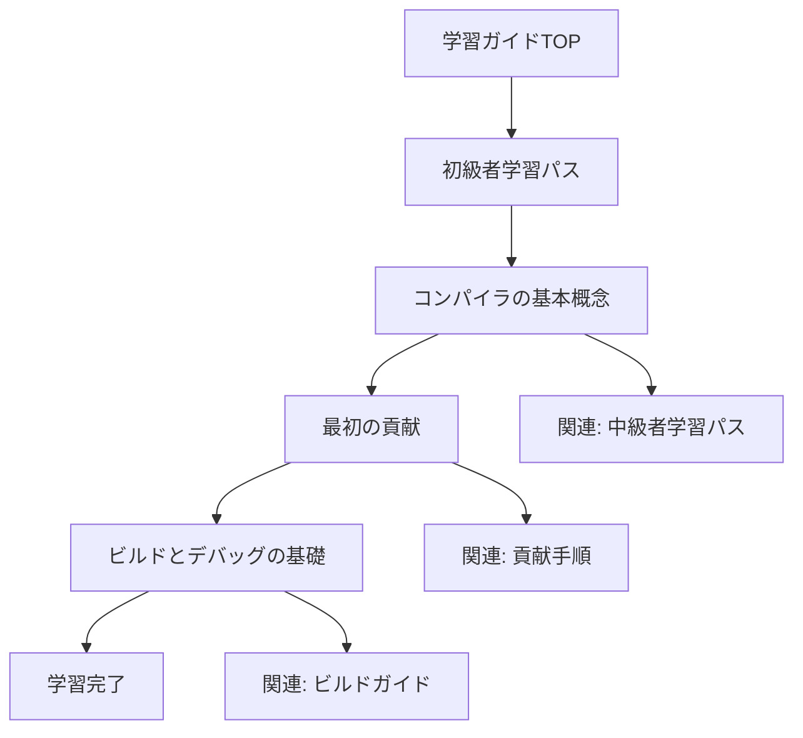
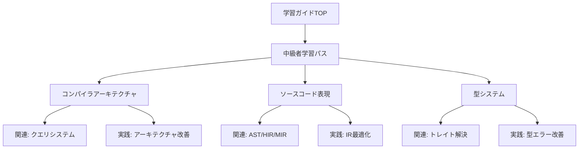
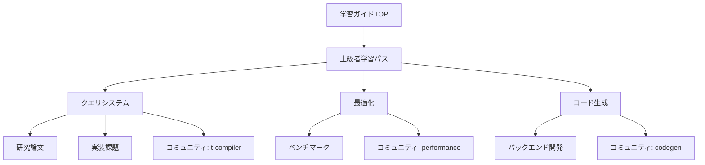
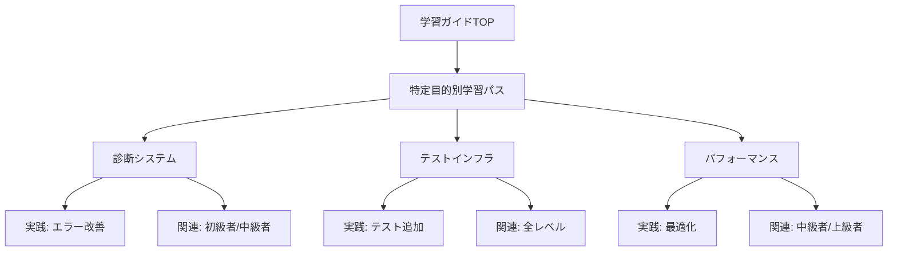

# rustc-dev-guide 学習ガイド リンク構造とナビゲーションパス設計

## ナビゲーション設計の基本方針

1. **多角的な学習経路**: 学習者のレベル、目的、興味に応じた複数のナビゲーションパスを提供
2. **コンテキスト維持**: 学習者が現在の位置と次のステップを常に認識できる構造
3. **横断的学習**: 必要に応じて関連トピックへ簡単に移動できる柔軟性
4. **進捗の可視化**: 学習の進捗が明確にわかる視覚的要素

## リンク構造の種類と役割

### 1. 階層リンク（垂直ナビゲーション）

学習パス内での論理的な進行を示すリンク

#### 構造例

```markdown
<!-- 各ページの先頭 -->
[学習ガイドTOP](../../README.md) > [初級者向け学習パス](../README.md) > [コンパイラの基本概念](./compiler-basics.md)

<!-- 各ページの末尾 -->
**前のトピック**: [学習パスの概要](../README.md)
**次のトピック**: [最初の貢献](./first-contribution.md)
**現在の進捗**: 1/3 (コンパイラの基本概念)
```

### 2. 水平リンク（同レベルナビゲーション）

同じレベルの関連トピックへの移動を支援するリンク

#### 構造例

```markdown
## 関連トピック
- [ソースコード表現](../intermediate/source-representation.md)
- [型システム](../intermediate/type-system.md)
- [クエリシステム](../advanced/query-system.md)
```

### 3. 深さリンク（詳細情報へのナビゲーション）

既存の技術ドキュメントへの参照リンク

#### 構造例

```markdown
## 詳細情報
- [コンパイラの概要](../../overview.md) - 全体的なコンパイラアーキテクチャ
- [クエリ：デマンド駆動コンパイル](../../query.md) - クエリシステムの詳細
- [高レベルコンパイラアーキテクチャ](../../part-2-intro.md) - アーキテクチャの理論的背景
```

### 4. 実践リンク（応用学習へのナビゲーション）

理論学習から実践活動への移行を促すリンク

#### 構造例

```markdown
## 実践的な学習
- [演習問題：コンパイラの基本](../../resources/exercises.md#beginner)
- [実践プロジェクト：簡単な診断改善](../../resources/projects.md#beginner)
- [コミュニティでの質問](https://rust-lang.zulipchat.com/#narrow/channel/182449-t-compiler.2Fhelp)
```

## 学習パス別ナビゲーション設計

### 1. 初級者向け学習パスのナビゲーション

#### 特徴

- 線形的な学習経路を重視
- 各ステップでの達成感を重視
- 次のステップへの明確な誘導

#### ナビゲーション構造



#### 各ページのナビゲーション要素

```markdown
<!-- ページヘッダー -->
# コンパイラの基本概念

<div class="learning-path">
  <span class="path-indicator">初級者パス</span>
  <span class="progress">1/3</span>
</div>

<!-- 本文内ナビゲーション -->
## 目次
1. [コンパイラとは](#コンパイラとは)
2. [Rustコンパイラの特徴](#rustコンパイラの特徴)
3. [実践演習](#実践演習)

<!-- ページフッター -->
<div class="navigation">
  <div class="prev">
    ← [学習パスの概要](../README.md)
  </div>
  <div class="progress">
    進捗: ●●○ (2/3)
  </div>
  <div class="next">
    [最初の貢献](./first-contribution.md) →
  </div>
</div>
```

### 2. 中級者向け学習パスのナビゲーション

#### 特徴

- モジュール式の学習を可能にする柔軟な構造
- 関連トピック間の移動を容易にする
- 深い理解を促進する横断的リンク

#### ナビゲーション構造



#### 各ページのナビゲーション要素

```markdown
<!-- ページヘッダー -->
# コンパイラアーキテクチャ

<div class="learning-path">
  <span class="path-indicator">中級者パス</span>
  <span class="module">モジュール 1/3</span>
</div>

<!-- サイドナビゲーション -->
<div class="sidebar">
  <h4>このモジュールのトピック</h4>
  <ul>
    <li><a href="#クエリシステムの設計">クエリシステムの設計</a></li>
    <li><a href="#メモリ管理">メモリ管理</a></li>
    <li><a href="#並列処理">並列処理</a></li>
  </ul>
  
  <h4>関連モジュール</h4>
  <ul>
    <li><a href="../source-representation.md">ソースコード表現</a></li>
    <li><a href="../type-system.md">型システム</a></li>
  </ul>
</div>

<!-- ページフッター -->
<div class="navigation">
  <div class="related-topics">
    <h4>関連トピック</h4>
    <ul>
      <li><a href="../advanced/query-system.md">詳細: クエリシステム</a></li>
      <li><a href="../../resources/exercises.md#intermediate">演習: アーキテクチャ</a></li>
    </ul>
  </div>
</div>
```

### 3. 上級者向け学習パスのナビゲーション

#### 特徴

- 専門的な深さを提供する階層構造
- 研究と実践の両面をサポート
- コミュニティとの連携を促進

#### ナビゲーション構造



### 4. 特定目的別学習パスのナビゲーション

#### 特徴

- 目的別の集中学習をサポート
- 柔軟な学習順序
- 実践的なプロジェクトへの直接接続

#### ナビゲーション構造



## グローバルナビゲーション要素

### 1. 学習ガイドの統合ナビゲーション

すべての学習ガイドページに共通するナビゲーション要素

```markdown
<!-- グローバルヘッダー -->
<div class="global-nav">
  <a href="../../README.md">学習ガイドTOP</a>
  <span class="separator">|</span>
  <a href="../../getting-started/README.md">初級者</a>
  <span class="separator">|</span>
  <a href="../../intermediate/README.md">中級者</a>
  <span class="separator">|</span>
  <a href="../../advanced/README.md">上級者</a>
  <span class="separator">|</span>
  <a href="../../specialization/README.md">特化</a>
  <span class="separator">|</span>
  <a href="../../resources/README.md">リソース</a>
</div>
```

### 2. パンくずリスト

現在の位置を明確に示す階層的なナビゲーション

```markdown
<div class="breadcrumb">
  <a href="../../../README.md">rustc-dev-guide</a> >
  <a href="../../README.md">学習ガイド</a> >
  <a href="../README.md">中級者学習パス</a> >
  <span class="current">コンパイラアーキテクチャ</span>
</div>
```

### 3. 進捗インジケータ

学習の進捗を視覚的に示す要素

```markdown
<div class="progress-indicator">
  <div class="progress-bar">
    <div class="progress-fill" style="width: 33%;"></div>
  </div>
  <span class="progress-text">学習パス進捗: 1/3 (33%)</span>
</div>
```

## インタラクティブなナビゲーション機能

### 1. 学習経路のカスタマイズ

学習者が自分の興味や目標に応じて学習経路をカスタマイズできる機能

```markdown
## 学習経路のカスタマイズ

### あなたの学習目標は何ですか？
- [ ] コンパイラの基本的な理解
- [ ] 特定コンポーネントの専門知識
- [ ] 新機能の開発能力
- [ ] パフォーマンス最適化
- [ ] コミュニティへの貢献

### 推奨学習経路
**あなたの目標に基づいた推奨経路:**
1. [コンパイラの基本概念](./getting-started/compiler-basics.md)
2. [ソースコード表現](./intermediate/source-representation.md)
3. [診断システム](./specialization/diagnostics.md)
```

### 2. 関連トピックの動的推薦

現在の学習内容に基づいて関連トピックを動的に推薦

```markdown
## 関連トピック

現在の学習内容「コンパイラアーキテクチャ」に関連するトピック:

**深掘りしたい場合:**
- [クエリシステムの詳細](./advanced/query-system.md)
- [インクリメンタルコンパイル](../../queries/incremental-compilation.md)

**実践的に学びたい場合:**
- [演習: アーキテクチャ改善](./resources/exercises.md#architecture)
- [プロジェクト: クエリ実装](./resources/projects.md#queries)
```

### 3. 学習成果の確認

各学習単位での理解度確認と次のステップへのガイダンス

```markdown
## 学習確認

### 理解度チェック
- [ ] コンパイラの主要フェーズを説明できる
- [ ] クエリシステムの役割を理解している
- [ ] インクリメンタルコンパイルの仕組みを説明できる

### 次のステップ
**理解度 80%以上:**
- [ソースコード表現に進む](./source-representation.md)

**理解度 60-80%:**
- [関連演習に取り組む](../../resources/exercises.md#intermediate)
- [コミュニティで質問する](https://rust-lang.zulipchat.com/)

**理解度 60%未満:**
- [基本概念を復習する](../getting-started/compiler-basics.md)
- [チュートリアル動画を視聴する](../../resources/references.md#videos)
```

## モバイル対応とアクセシビリティ

### 1. レスポンシブデザイン

異なるデバイスでのナビゲーション体験の最適化

```markdown
<!-- モバイル用のコンパクトなナビゲーション -->
<div class="mobile-nav">
  <button class="menu-toggle">☰ メニュー</button>
  <div class="mobile-menu">
    <a href="../../README.md">学習ガイドTOP</a>
    <a href="../README.md">現在のパス</a>
    <a href="./next-topic.md">次へ</a>
  </div>
</div>
```

### 2. キーボードナビゲーション

キーボードのみでのナビゲーションサポート

```markdown
<!-- キーボードショートカットの案内 -->
<div class="keyboard-shortcuts">
  <p>キーボードショートカット:</p>
  <ul>
    <li><kbd>N</kbd> - 次のトピック</li>
    <li><kbd>P</kbd> - 前のトピック</li>
    <li><kbd>H</kbd> - 学習ガイドTOP</li>
    <li><kbd>S</kbd> - 検索</li>
  </ul>
</div>
```

このナビゲーション設計により、学習者は自分のレベルや目的に応じて最適な学習経路を見つけ、効率的にrustcコンパイラの開発を学習することができます。
