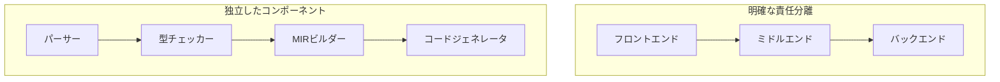
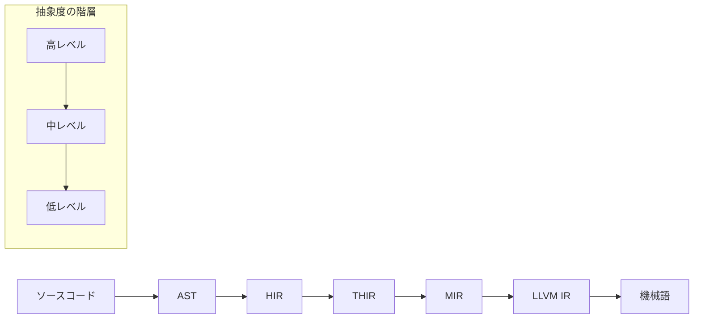

# アーキテクチャ理解

このセクションでは、Rustコンパイラの内部アーキテクチャについて深く学習します。設計思想、コンポーネント間の複雑な相互作用、そして将来の拡張性について理解することで、コンパイラ全体を体系的に把握することができます。

## コンパイラアーキテクチャの全体像

### 設計思想

#### 1. モジュラー性と分離



**設計原則**:

- **単一責任**: 各コンポーネントは明確な責任を持つ
- **疎結合**: コンポーネント間の依存を最小限にする
- **高凝集**: 関連する機能を一つのコンポーネントにまとめる
- **拡張性**: 新しい機能の追加が容易である

#### 2. デマンド駆動アーキテクチャ

```rust
// クエリシステムの基本構造
pub struct QueryCtxt<'tcx> {
    queries: QueryEngine<'tcx>,
    arena: Arena<'tcx>,
    interners: Interners<'tcx>,
}

// デマンド駆動のクエリ定義
impl<'tcx> QueryCtxt<'tcx> {
    pub fn type_of(self, def_id: DefId) -> Ty<'tcx> {
        self.queries.type_of(self, def_id)
    }
    
    pub fn mir_built(self, def_id: DefId) -> Body<'tcx> {
        self.queries.mir_built(self, def_id)
    }
}
```

**特徴**:

- **遅延評価**: 必要な情報だけを計算
- **キャッシュ**: 計算結果を再利用
- **依存追跡**: クエリ間の依存関係を管理
- **インクリメンタル**: 変更された部分のみ再計算

#### 3. 中間表現の階層化



**各IRの役割**:

- **AST**: ソースコードの構造を直接表現
- **HIR**: 型情報が付加された高レベル表現
- **THIR**: 型付きの高レベル中間表現
- **MIR**: 制御フローグラフとしての中レベル表現
- **LLVM IR**: バックエンドのための低レベル表現

## コアコンポーネントの詳細

### 1. クエリシステム

#### アーキテクチャの設計

```rust
// クエリエンジンの実装
pub struct QueryEngine<'tcx> {
    jobs: ActiveQueryJobs<'tcx>,
    cache: QueryCache<'tcx>,
    dep_graph: DepGraph,
}

// クエリの依存関係
pub struct QueryDepGraph {
    nodes: FxHashMap<QueryKey, QueryNode>,
    edges: FxHashSet<(QueryKey, QueryKey)>,
}

// インクリメンタルコンパイルの状態
pub struct IncrementalCompileState {
    dep_graph: SerializedDepGraph,
    query_cache: OnDiskCache,
    dirty_nodes: FxHashSet<QueryKey>,
}
```

#### デマンド駆動の実装

```rust
// クエリの実行ロジック
impl<'tcx> QueryEngine<'tcx> {
    pub fn execute_query<Q>(&self, key: Q::Key) -> Q::Value 
    where 
        Q: Query<'tcx>,
    {
        // 1. キャッシュのチェック
        if let Some(cached) = self.cache.get::<Q>(&key) {
            return cached;
        }
        
        // 2. 依存関係の記録
        let job = self.start_query::<Q>(&key);
        
        // 3. クエリの実行
        let result = Q::execute(self.tcx, key);
        
        // 4. 結果のキャッシュ
        self.cache.insert::<Q>(key, result.clone());
        
        // 5. 依存関係の確定
        self.finish_query(job);
        
        result
    }
}
```

#### インクリメンタルコンパイル

```rust
// 変更検出メカニズム
impl<'tcx> IncrementalCompileState<'tcx> {
    pub fn detect_changes(&mut self, new_inputs: &InputFiles) -> Vec<QueryKey> {
        let mut dirty_queries = Vec::new();
        
        for (file_id, file_content) in new_inputs {
            if let Some(old_content) = self.previous_inputs.get(file_id) {
                if old_content != file_content {
                    // ファイルが変更された場合、依存クエリをマーク
                    let affected_queries = self.dep_graph.find_affected_queries(file_id);
                    dirty_queries.extend(affected_queries);
                }
            }
        }
        
        dirty_queries
    }
}
```

### 2. 型システムのアーキテクチャ

#### 型の表現と管理

```rust
// 型の内部表現
pub struct Ty<'tcx> {
    kind: Interned<TyKind<'tcx>>,
}

// 型の種類と階層
pub enum TyKind<'tcx> {
    // 基本型
    Bool,
    Char,
    Int(IntTy),
    Uint(UintTy),
    Float(FloatTy),
    
    // 複合型
    Adt(AdtDef<'tcx>, SubstsRef<'tcx>),
    Tuple(&'tcx List<Ty<'tcx>>),
    Array(Ty<'tcx>, Const<'tcx>),
    Slice(Ty<'tcx>),
    
    // 関数型
    FnDef(FnDef<'tcx>, SubstsRef<'tcx>),
    FnPtr(PolyFnSig<'tcx>),
    
    // ジェネリック型
    Param(ParamTy),
    Projection(ProjectionTy<'tcx>),
    Opaque(OpaqueTy<'tcx>),
    
    // ライフタイム付き型
    Bound(DebruijnIndex, BoundTy),
    Placeholder(PlaceholderTy),
    Infer(InferTy),
}
```

#### 型推論のアーキテクチャ

```rust
// 型推論エンジン
pub struct InferCtxt<'a, 'tcx> {
    tcx: TyCtxt<'tcx>,
    type_variables: TypeVariableTable<'a>,
    obligations: PredicateObligations<'a>,
    region_constraints: RegionConstraintData<'a>,
}

// 制約の収集と解決
impl<'a, 'tcx> InferCtxt<'a, 'tcx> {
    pub fn unify<T>(&mut self, a: T, b: T) -> InferResult<'tcx>
    where 
        T: ToTrace<'tcx>,
    {
        // 1. 制約の正規化
        let a = self.shrink(a);
        let b = self.shrink(b);
        
        // 2. 制約の統一
        match (a.kind(), b.kind()) {
            (Infer(InferTy::TyVar(a_id)), Infer(InferTy::TyVar(b_id))) => {
                self.type_variables.unify(*a_id, *b_id)
            }
            (Infer(InferTy::TyVar(var_id)), other) => {
                self.type_variables.instantiate(*var_id, other)
            }
            // ... 他の統一ケース
        }
    }
}
```

#### トレイト解決のアーキテクチャ

```rust
// トレイト解決エンジン
pub struct TraitEngine<'tcx> {
    tcx: TyCtxt<'tcx>,
    impl_map: ImplMap<'tcx>,
    cache: TraitCache<'tcx>,
}

// トレイト実装の探索
impl<'tcx> TraitEngine<'tcx> {
    pub fn fulfill_obligation(
        &mut self, 
        obligation: &TraitObligation<'tcx>
    ) -> Result<Vec<ImplSource<'tcx>>, SelectionError<'tcx>> {
        // 1. キャッシュのチェック
        if let Some(cached) = self.cache.get(obligation) {
            return Ok(cached);
        }
        
        // 2. 実装候補の収集
        let candidates = self.collect_impl_candidates(obligation)?;
        
        // 3. 候補の評価と選択
        let selected = self.evaluate_candidates(candidates, obligation)?;
        
        // 4. 結果のキャッシュ
        self.cache.insert(obligation, selected.clone());
        
        Ok(selected)
    }
}
```

### 3. MIRアーキテクチャ

#### MIRの設計原則

```rust
// MIRの基本構造
pub struct Body<'tcx> {
    pub basic_blocks: IndexVec<BasicBlock, BasicBlockData<'tcx>>,
    pub local_decls: IndexVec<Local, LocalDecl<'tcx>>,
    pub user_type_annotations: IndexVec<UserTypeAnnotationIndex, UserTypeAnnotation>,
    pub arg_count: usize,
    pub span: Span,
    pub generator_kind: Option<GeneratorKind>,
}

// 制御フローグラフとしての表現
pub struct BasicBlockData<'tcx> {
    pub statements: Vec<Statement<'tcx>>,
    pub terminator: Option<Terminator<'tcx>>,
    pub is_cleanup: bool,
}

// SSA形式の設計
pub enum Rvalue<'tcx> {
    Use(Operand<'tcx>),
    Repeat(Operand<'tcx>, Const<'tcx>),
    Ref(Region<'tcx>, BorrowKind, Place<'tcx>),
    BinaryOp(BinOp, Operand<'tcx>, Operand<'tcx>),
    // ... 他の操作
}
```

#### 最適化パイプライン

```rust
// 最適化パイプラインの構造
pub struct MirPassPipeline {
    passes: Vec<Box<dyn MirPass>>,
}

impl MirPassPipeline {
    pub fn run_passes<'tcx>(
        &self,
        tcx: TyCtxt<'tcx>,
        body: &mut Body<'tcx>,
    ) {
        for pass in &self.passes {
            let timer = tcx.prof.generic_activity(pass.name());
            timer.start();
            
            pass.run_pass(tcx, body);
            
            timer.finish();
            
            // 各パス後の検証
            if cfg!(debug_assertions) {
                validate_mir(body);
            }
        }
    }
}

// 最適化パスの例
impl<'tcx> MirPass<'tcx> for DeadCodeElimination {
    fn run_pass(&self, tcx: TyCtxt<'tcx>, body: &mut Body<'tcx>) {
        // デッドコードの検出と削除
        let mut used_locals = collect_used_locals(body);
        
        for (local, decl) in body.local_decls.iter_enumerated() {
            if !used_locals.contains(local) && !is_essential_local(local) {
                decl.local_info = LocalInfo::Dead;
            }
        }
        
        // 未使用の基本ブロックの削除
        remove_dead_blocks(body, &used_locals);
    }
}
```

### 4. バックエンドアーキテクチャ

#### コード生成のパイプライン

```rust
// コード生成コンテキスト
pub struct CodegenCx<'ll, 'tcx> {
    pub llcx: &'ll llvm::Context,
    pub llmod: &'ll llvm::Module,
    pub builder: Builder<'ll>,
    pub tcx: TyCtxt<'tcx>,
    pub values: FxHashMap<ValueIndex, &'ll llvm::Value>,
    pub functions: FxHashMap<FunctionInstance<'tcx>, &'ll llvm::Value>,
}

// MIRからLLVM IRへの変換
impl<'ll, 'tcx> CodegenCx<'ll, 'tcx> {
    pub fn mir_to_llvm(&mut self, mir: &Body<'tcx>) {
        // 1. 関数シグネチャの生成
        let llfn = self.declare_function(mir);
        
        // 2. 基本ブロックの変換
        for (bb_id, bb_data) in mir.basic_blocks.iter_enumerated() {
            let llbb = self.declare_basic_block(bb_id);
            self.builder.position_at_end(llbb);
            
            // 3. ステートメントの変換
            for stmt in &bb_data.statements {
                self.codegen_statement(stmt);
            }
            
            // 4. ターミネータの変換
            if let Some(terminator) = &bb_data.terminator {
                self.codegen_terminator(terminator);
            }
        }
    }
}
```

#### 単相化のアーキテクチャ

```rust
// 単相化コレクタ
pub struct MonoCollector<'a, 'tcx> {
    tcx: TyCtxt<'tcx>,
    items: Vec<MonoItem<'tcx>>,
    visited: FxHashSet<DefId>,
}

// ジェネリックの具体化
impl<'a, 'tcx> MonoCollector<'a, 'tcx> {
    pub fn collect_items(&mut self, crate_num: CrateNum) {
        let crate_items = self.tcx.hir_crate_items(crate_num);
        
        // 1. 全てのアイテムを収集
        self.collect_items_from_items(crate_items);
        
        // 2. ジェネリックの具体化を収集
        self.collect_mono_instances();
        
        // 3. 依存関係の解決
        self.resolve_dependencies();
    }
    
    fn collect_mono_instances(&mut self) {
        for mono_instance in self.tcx.mono_instances() {
            if self.should_mono(mono_instance) {
                self.items.push(MonoItem::Fn(mono_instance));
            }
        }
    }
}
```

## アーキテクチャの拡張性

### 1. 新しい中間表現の追加

#### 拡張ポイントの設計

```rust
// 中間表現のトレイト
pub trait IntermediateRepresentation {
    type Value;
    type Type;
    type BasicBlock;
    
    fn from_hir(hir: &hir::Body) -> Self;
    fn optimize(&mut self);
    fn verify(&self) -> bool;
}

// 新しいIRの実装
pub struct CustomIR {
    values: Vec<CustomValue>,
    types: Vec<CustomType>,
    blocks: Vec<CustomBlock>,
}

impl IntermediateRepresentation for CustomIR {
    type Value = CustomValue;
    type Type = CustomType;
    type BasicBlock = CustomBlock;
    
    fn from_hir(hir: &hir::Body) -> Self {
        // HIRからカスタムIRへの変換
    }
    
    fn optimize(&mut self) {
        // カスタム最適化パスの実行
    }
    
    fn verify(&self) -> bool {
        // IRの妥当性検証
    }
}
```

### 2. 新しい最適化パスの追加

#### パイプラインの拡張

```rust
// 最適化パスの登録
pub fn register_optimization_passes(
    passes: &mut Vec<Box<dyn MirPass>>,
    config: &OptimizationConfig,
) {
    // 既存のパス
    passes.push(Box::new(ConstProp));
    passes.push(Box::new(DeadCodeElimination));
    
    // 条件付きのパス
    if config.enable_advanced_opts {
        passes.push(Box::new(AdvancedOptimization));
    }
    
    // カスタムパスの登録
    if config.enable_custom_passes {
        passes.push(Box::new(CustomOptimization));
    }
}

// 新しい最適化パスの実装
impl<'tcx> MirPass<'tcx> for CustomOptimization {
    fn name(&self) -> &'static str {
        "custom_optimization"
    }
    
    fn run_pass(&self, tcx: TyCtxt<'tcx>, body: &mut Body<'tcx>) {
        // カスタム最適化ロジック
        self.optimize_arithmetic_operations(body);
        self.optimize_memory_accesses(body);
    }
}
```

### 3. 新しいバックエンドのサポート

#### バックエンド抽象化

```rust
// バックエンドのトレイト
pub trait CodegenBackend {
    fn codegen_crate<'tcx>(
        &self,
        tcx: TyCtxt<'tcx>,
        metadata: &EncodedMetadata,
        need_metadata_module: bool,
    ) -> Box<dyn Any>;
    
    fn target_features(&self, sess: &Session) -> Vec<Symbol>;
    fn print_version(&self);
    fn print_passes(&self);
}

// 新しいバックエンドの実装
pub struct CustomBackend;

impl CodegenBackend for CustomBackend {
    fn codegen_crate<'tcx>(
        &self,
        tcx: TyCtxt<'tcx>,
        metadata: &EncodedMetadata,
        need_metadata_module: bool,
    ) -> Box<dyn Any> {
        let mut cx = CustomCodegenCx::new(tcx);
        
        // カスタムコード生成
        cx.codegen_crate(metadata, need_metadata_module);
        
        Box::new(cx.output)
    }
    
    fn target_features(&self, sess: &Session) -> Vec<Symbol> {
        vec![
            Symbol::intern("custom_feature1"),
            Symbol::intern("custom_feature2"),
        ]
    }
}
```

## パフォーマンスとスケーラビリティ

### 1. 並列化アーキテクチャ

```rust
// 並列実行の管理
pub struct ParallelExecutor {
    thread_pool: ThreadPool,
    work_queue: WorkQueue,
    dependency_graph: DependencyGraph,
}

impl ParallelExecutor {
    pub fn execute_parallel<'tcx>(
        &self,
        queries: Vec<QueryJob<'tcx>>,
    ) -> Vec<QueryResult<'tcx>> {
        // 1. 依存関係の分析
        let execution_groups = self.dependency_graph.topological_sort(queries);
        
        // 2. 並列実行
        let mut results = Vec::new();
        for group in execution_groups {
            let group_results = self.execute_group_parallel(group);
            results.extend(group_results);
        }
        
        results
    }
}
```

### 2. メモリ管理の最適化

```rust
// アリーナアロケータの実装
pub struct Arena<'tcx> {
    chunks: Vec<ArenaChunk>,
    current_chunk: usize,
    marker: PhantomData<&'tcx ()>,
}

impl<'tcx> Arena<'tcx> {
    pub fn alloc<T>(&mut self, value: T) -> &'tcx T {
        // 1. 十分な空間の確認
        if !self.current_chunk().can_alloc::<T>() {
            self.allocate_new_chunk();
        }
        
        // 2. 値の割り当て
        let ptr = self.current_chunk().alloc::<T>();
        unsafe {
            ptr.write(value);
            &*ptr
        }
    }
    
    fn allocate_new_chunk(&mut self) {
        let new_chunk = ArenaChunk::new(CHUNK_SIZE);
        self.chunks.push(new_chunk);
        self.current_chunk = self.chunks.len() - 1;
    }
}
```

## 関連ドキュメント

より詳細な情報については、以下のドキュメントを参照してください：

- [クエリ：デマンド駆動コンパイル](../../query.md) - クエリシステムの詳細
- [クエリ評価モデルの詳細](../../queries/query-evaluation-model-in-detail.md) - クエリの深い理解
- [インクリメンタルコンパイル](../../queries/incremental-compilation.md) - 差分コンパイルの技術
- [rustcのメモリ管理](../../memory.md) - メモリ管理の詳細
- [並列コンパイル](../../parallel-rustc.md) - 並列化の実装

## 次のステップ

アーキテクチャを深く理解したら、次は[新機能開発](./feature-development.md)を学びましょう。コンパイラの設計を理解することで、より効果的な新機能の実装ができるようになります。
