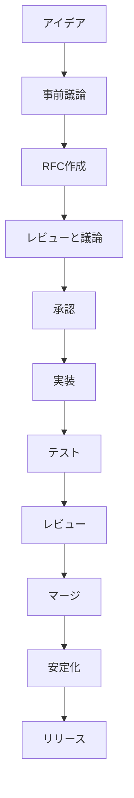

# 新機能開発

このセクションでは、Rustコンパイラに新しい機能を設計・実装するプロセスについて学習します。RFCプロセスから実装、テスト、安定化まで、新機能開発の全般を体系的に理解しましょう。

## 新機能開発のライフサイクル

### 開発プロセスの概要



### 各フェーズの詳細

#### 1. アイデアと事前議論

- **アイデアの具体化**: 機能の要件と仕様の明確化
- **実現可能性の評価**: 技術的な実現可能性の確認
- **コミュニティとの議論**: Zulipやフォーラムでの初期議論

#### 2. RFCプロセス

- **RFCの作成**: 正式な提案文書の作成
- **レビュー期間**: コミュニティからのフィードバック収集
- **最終決定**: チームによる承認却

#### 3. 実装フェーズ

- **設計の詳細化**: 実装計画の策定
- **プロトタイプ作成**: 基本的な実装の作成
- **段階的開発**: 機能の段階的な実装

#### 4. テストとレビュー

- **包括的なテスト**: 機能テスト、回帰テスト、パフォーマンステスト
- **コードレビュー**: コミュニティからのレビューと改善
- **統合テスト**: 既存コードとの統合テスト

#### 5. 安定化プロセス

- **実験的機能**: 実験的フラグでの提供
- **フィードバック収集**: 実際の使用からのフィードバック
- **安定化**: 安定版機能への昇格

## RFCプロセスの詳細

### RFCの構造と内容

#### 1. 基本的な構造

```markdown
# RFC: 新機能のタイトル

- **始めた日**: 2023-XX-XX
- **RFC PR**: [rust-lang/rfcs#XXXX](https://github.com/rust-lang/rfcs/pull/XXXX)
- **実装PR**: [rust-lang/rust#XXXXX](https://github.com/rust-lang/rust/pull/XXXXX)
- **機能**: 新機能の名前
- **ステータス**: 実装中/承認済み/完了
```

#### 2. 概要と動機

```markdown
## 概要

このRFCは、Rustに新しい機能「機能名」を追加することを提案します。この機能により、開発者は〜〜ができるようになります。

## 動機

### 問題の説明

現在のRustでは、以下の問題があります：
- 問題1の詳細な説明
- 問題2の詳細な説明
- 実際のコード例での問題の提示

### 解決策の必要性

この問題を解決することで、以下の利点があります：
- 開発者の生産性向上
- コードの可読性改善
- パフォーマンスの向上
```

#### 3. 詳細な設計

```markdown
## 詳細な設計

### 構文の変更

```rust
// 新しい構文の例
fn new_function<T: NewTrait>(param: T) -> T {
    param.new_method()
}
```

### セマンティクス

新しい構文の意味論の詳細な説明：

- 型チェックのルール
- 実行時の振る舞い
- エラーハンドリング

### 後方互換性

既存コードへの影響：

- 既存コードの互換性
- 移行パスの提供
- 非推奨化の計画

```

### 4. 実装計画

```markdown
## 実装計画

### フェーズ1: 基本的な実装
- [ ] パーサーの拡張
- [ ] ASTノードの追加
- [ ] 基本的な型チェック

### フェーズ2: 詳細な実装
- [ ] MIRへの変換
- [ ] 最適化パスの追加
- [ ] コード生成の実装

### フェーズ3: テストと安定化
- [ ] 包括的なテスト
- [ ] ドキュメントの更新
- [ ] 安定化プロセス
```

### RFCの書き方のベストプラクティス

#### 1. 明確な問題定義

```markdown
### 悪い例

Rustに新しい機能が欲しい。

### 良い例

現在のRustでは、非同期関数の結果を効率的に処理する方法が限られています。具体的には、以下のようなコードでパフォーマンスの問題が発生します：

```rust
async fn process_data() -> Result<Data, Error> {
    // 複雑な非同期処理
}

// 現在の制限
let result = process_data().await?;
// ここでの追加の処理が非効率
```

```

#### 2. 具体的な解決策

```markdown
### 悪い例

新しい構文を追加して問題を解決します。

### 良い例

以下の新しい構文を提案します：

```rust
// 提案する新しい構文
let result = try! {
    process_data().await?;
    additional_processing(result);
};
```

この構文により：

1. 早期リターンの最適化
2. エラーハンドリングの改善
3. コードの可読性向上

```

#### 3. 実現可能性の考慮

```markdown
### 技術的実現可能性

#### パーサーの変更
- 新しいトークンの追加が必要
- 既存の式パーサーの拡張
- あいまいさのない構文設計

#### 型システムへの影響
- 新しい型の追加
- 型推論アルゴリズムの変更
- 後方互換性の確保

#### コード生成の考慮
- LLVM IRへの変換
- 最適化の影響
- ターゲット依存の問題
```

## 実装の詳細

### 1. パーサーの拡張

#### トークンの追加

```rust
// src/libsyntax/token.rs
#[derive(Clone, Copy, PartialEq, Eq, Debug)]
pub enum TokenKind {
    // 既存のトークン...
    
    // 新しい機能のためのトークン
    TryKeyword,
    TryBlock,
}

// src/libsyntax/parse/token.rs
impl TokenKind {
    pub fn try_keyword(self) -> bool {
        matches!(self, TokenKind::TryKeyword)
    }
}
```

#### 構文解析の実装

```rust
// src/libsyntax/parse/parser.rs
impl<'a> Parser<'a> {
    pub fn parse_try_expr(&mut self) -> PResult<'a, P<Expr>> {
        self.expect_keyword(kw::Try)?;
        
        if self.token.is_keyword(kw::Block) {
            self.parse_try_block()
        } else {
            self.parse_try_expression()
        }
    }
    
    fn parse_try_block(&mut self) -> PResult<'a, P<Expr>> {
        self.expect(&token::OpenDelim(token::DelimToken::Brace))?;
        let block = self.parse_block()?;
        self.expect(&token::CloseDelim(token::DelimToken::Brace))?;
        
        Ok(Expr {
            id: DUMMY_NODE_ID,
            kind: ExprKind::TryBlock(block),
            span: self.prev_span,
        })
    }
}
```

### 2. ASTの拡張

#### 新しいノードの追加

```rust
// src/libsyntax/ast.rs
#[derive(Debug, Clone, Encodable, Decodable)]
pub enum ExprKind {
    // 既存の式の種類...
    
    // 新しい機能のための式
    TryBlock(P<Block>),
    TryExpression {
        expr: P<Expr>,
        catch_clause: Option<P<CatchClause>>,
    },
}

#[derive(Debug, Clone, Encodable, Decodable)]
pub struct CatchClause {
    pub pat: P<Pat>,
    pub body: P<Block>,
}
```

#### ビジタの実装

```rust
// src/libsyntax/visit.rs
impl<'ast> Visitor<'ast> for FnVisitor {
    fn visit_expr(&mut self, expr: &'ast Expr) {
        match &expr.kind {
            ExprKind::TryBlock(block) => {
                self.visit_block(block);
            }
            ExprKind::TryExpression { expr, catch_clause } => {
                self.visit_expr(expr);
                if let Some(catch) = catch_clause {
                    self.visit_catch_clause(catch);
                }
            }
            _ => walk::walk_expr(self, expr),
        }
    }
}
```

### 3. 型チェックの実装

#### 型推論の拡張

```rust
// src/librustc_typeck/fn_ctxt.rs
impl<'a, 'tcx> FnCtxt<'a, 'tcx> {
    pub fn check_try_block(
        &mut self,
        block: &'tcx hir::Block<'tcx>,
    ) -> Ty<'tcx> {
        // ブロック内の型チェック
        let block_ty = self.check_block(block);
        
        // tryブロックの特別な型処理
        match block_ty.kind() {
            TyKind::Never => {
                // ブロックがnever型の場合
                self.tcx.types.never
            }
            TyKind::Result(ok_ty, err_ty) => {
                // 結果型の処理
                self.handle_result_type(ok_ty, err_ty)
            }
            _ => {
                // その他の型の処理
                self.handle_other_types(block_ty)
            }
        }
    }
}
```

#### エラー報告の実装

```rust
// src/librustc_typeck/errors.rs
impl<'a, 'tcx> FnCtxt<'a, 'tcx> {
    pub fn emit_try_block_error(&self, span: Span, msg: &str) {
        self.struct_span_err(span, &format!("try block error: {}", msg))
            .span_label(span, "invalid try block")
            .help("consider using a different syntax")
            .emit();
    }
}
```

### 4. MIRへの変換

#### MIR構築の拡張

```rust
// src/librustc_mir/build.rs
impl<'a, 'tcx> Builder<'a, 'tcx> {
    pub fn ast_to_mir_try_block(
        &mut self,
        block: &'tcx hir::Block<'tcx>,
    ) -> BasicBlock {
        // tryブロックの開始
        let try_block = self.start_new_block();
        
        // ブロック内のステートメントの変換
        for stmt in block.stmts {
            self.ast_to_mir_statement(stmt);
        }
        
        // 例外処理の基本ブロック
        let catch_block = self.build_catch_handler(block);
        
        // try-catchの接続
        self.terminate(try_block, TerminatorKind::Try {
            body: try_block,
            catch_block,
            destination: self.next_block(),
        });
        
        try_block
    }
}
```

### 5. テストの実装

#### 機能テスト

```rust
// tests/ui/try_blocks.rs
fn main() {
    // 基本的なtryブロック
    let result = try {
        Ok(42)
    };
    assert_eq!(result, Ok(42));
    
    // エラーハンドリング
    let error_result = try {
        Err("error message")
    };
    assert!(error_result.is_err());
}

// tests/ui/try_blocks.stderr
error[E0001]: try block must return Result type
 --> try_blocks.rs:8:14
  |
8 |     let result = try {
  |              ^^^
  |
  = help: ensure the block returns a Result<T, E>
```

#### 回帰テスト

```rust
// tests/ui/try_blocks_regression.rs
// 既存機能との互換性テスト
fn existing_features() {
    // 既存の機能が影響を受けないことを確認
    let x = 5;
    let y = x + 3;
    assert_eq!(y, 8);
}
```

## 安定化プロセス

### 1. 実験的機能としての提供

#### フィーチャーゲートの設定

```rust
// src/librustc_feature_gate/active.rs
impl Features {
    pub const TRY_BLOCKS: Feature = Feature {
        name: "try_blocks",
        since: Some("1.70.0"),
        issue: Some(12345),
        description: "try blocks for error handling",
    };
}
```

#### 条件付きコンパイル

```rust
// src/librustc_typeck/fn_ctxt.rs
impl<'a, 'tcx> FnCtxt<'a, 'tcx> {
    pub fn check_try_block(
        &mut self,
        block: &'tcx hir::Block<'tcx>,
    ) -> Ty<'tcx> {
        // フィーチャーゲートのチェック
        self.tcx.sess().check_feature_gate(
            sym::try_blocks,
            block.span,
            "try blocks are experimental"
        );
        
        // 実際の型チェック処理
        self.check_try_block_impl(block)
    }
}
```

### 2. フィードバック収集

#### 使用状況のモニタリング

```rust
// src/librustc_middle/ty/query/mod.rs
impl<'tcx> TyCtxt<'tcx> {
    pub fn report_try_block_usage(&self, span: Span) {
        if let Some(telemetry) = self.telemetry {
            telemetry.record_feature_use("try_blocks", span);
        }
    }
}
```

#### ユーザーフィードバックの収集

```rust
// src/librustc_errors/registry.rs
impl Registry {
    pub fn try_block_feedback(&self, span: Span, message: &str) {
        self.struct_span_warn(span, "try block feedback")
            .help("Please provide feedback at: https://github.com/rust-lang/rust/issues/XXXXX")
            .emit();
    }
}
```

### 3. 安定化への移行

#### 安定化の基準

- **実装の完了**: 全ての機能が実装されている
- **テストの網羅**: 十分なテストが存在する
- **ドキュメントの整備**: ドキュメントが完成している
- **コミュニティの支持**: コミュニティからの支持がある
- **実績の確認**: 実験的使用で問題がない

#### 安定化の手順

```rust
// src/librustc_feature_gate/active.rs
impl Features {
    // 実験的から安定へ
    pub const TRY_BLOCKS: Feature = Feature {
        name: "try_blocks",
        since: Some("1.75.0"), // 安定版バージョン
        issue: Some(12345),
        description: "try blocks for error handling",
        // 実験的フラグを削除
    };
}
```

## ベストプラクティス

### 1. 設計の原則

#### 後方互換性の確保

```rust
// 悪い例: 既存の振る舞いを変更
fn existing_function() -> i32 {
    // 既存の振る舞いを破壊する変更
    42
}

// 良い例: 新しい機能を追加
fn existing_function() -> i32 {
    // 既存の振る舞いを維持
    42
}

fn new_function() -> Result<i32, Error> {
    // 新しい機能を追加
    Ok(existing_function())
}
```

#### 一貫性の維持

```rust
// 既存のパターンに従う実装
impl<'a, 'tcx> FnCtxt<'a, 'tcx> {
    // 既存の命名規則に従う
    pub fn check_new_feature(&mut self, feature: &'tcx hir::Item<'tcx>) {
        // 既存のエラーハンドリングパターンに従う
        self.check_feature_impl(feature)
    }
}
```

### 2. 実装のガイドライン

#### 段階的開発

```rust
// フェーズ1: 基本的な機能
fn phase1_implementation() {
    // 最小限の機能を実装
    basic_functionality()
}

// フェーズ2: 拡張機能
fn phase2_implementation() {
    // 追加機能を実装
    extended_functionality()
}

// フェーズ3: 最適化
fn phase3_implementation() {
    // パフォーマンス最適化
    optimized_functionality()
}
```

#### テストの網羅性

```rust
// 全てのケースをカバーするテスト
#[test]
fn test_all_cases() {
    // 正常ケース
    test_normal_case();
    
    // エラーケース
    test_error_case();
    
    // 境界ケース
    test_edge_case();
    
    // 回帰ケース
    test_regression_case();
}
```

### 3. コミュニティとの協調

#### 透明性の確保

```markdown
## 進捗の定期的な報告

### 週次進捗
- 実装の進捗状況
- 遭遇した問題と解決策
- 次週の計画

### マイルストーンの共有
- 各フェーズの完了時期
- テスト結果の共有
- フィードバックの対応状況
```

#### フィードバックの受入

```rust
// フィードバックに基づいた改善
impl NewFeature {
    pub fn improve_based_on_feedback(&mut self, feedback: &UserFeedback) {
        match feedback.suggestion {
            Suggestion::Performance => self.optimize_performance(),
            Suggestion::Usability => self.improve_usability(),
            Suggestion::Documentation => self.update_documentation(),
        }
    }
}
```

## 関連ドキュメント

より詳細な情報については、以下のドキュメントを参照してください：

- [新しい言語機能の実装](../../implementing_new_features.md) - 機能実装の詳細なガイド
- [フィーチャーゲート](../../feature-gates.md) - フィーチャーゲートの管理
- [安定性属性](../../stability.md) - 安定性の管理
- [言語機能の安定化](../../stabilization_guide.md) - 安定化プロセス

## 次のステップ

新機能開発を学習したら、次は[パフォーマンス最適化](./performance.md)を学びましょう。コンパイラのパフォーマンスを理解することで、より効率的な実装ができるようになります。
