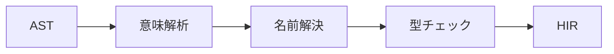
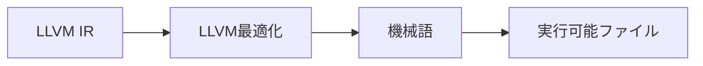
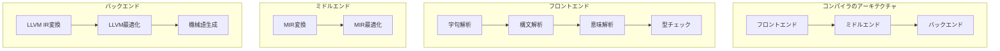

# コンパイラの基本概念

このセクションでは、コンパイラの基本概念とRustコンパイラの特徴について学習します。コンパイラ開発を始めるにあたって、基本的な知識を身につけましょう。

## コンパイラとは

### コンパイラの定義と役割

コンパイラは、人間が理解しやすい高級言語で書かれたソースコードを、コンピュータが直接実行できる機械語や中間コードに変換するプログラムです。

#### 主な役割

- **翻訳**: 高級言語から機械語への変換
- **最適化**: プログラムの効率改善
- **エラー検出**: 文法エラーや型エラーの発見
- **コード生成**: 実行可能ファイルの作成

#### インタプリタとの違い

| 特徴 | コンパイラ | インタプリタ |
|------|----------|------------|
| 実行方法 | 一括変換後実行 | 1行ずつ解釈・実行 |
| 実行速度 | 高速 | 比較的低速 |
| エラー検出 | コンパイル時 | 実行時 |
| 最適化 | 可能 | 限定的 |
| 代表例 | C++, Rust | Python, Ruby |

## Rustコンパイラの特徴

### 安全性の重視

Rustコンパイラは、安全性を第一に考えて設計されています。

#### 所有権システム

```rust
// 所有権システムの例
fn main() {
    let s1 = String::from("hello");
    let s2 = s1; // s1の所有権がs2に移動
    println!("{}", s1); // エラー：s1はもはや使用できない
    // println!("{}", s2); // これはOK
}
```

#### ゼロコスト抽象化

```rust
// ゼロコスト抽象化の例
fn process<T: Copy + Clone>(items: &[T]) -> Vec<T> {
    items.iter().map(|&item| item).collect() // コンパイル時に最適化される
}

// 高水準な抽象化でも実行時コストはゼロ
fn expensive_computation() -> i32 {
    let result = complex_calculation();
    result // コンパイル時に計算される
}
```

### メモリ安全性

- **借用チェッカー**: コンパイル時に借用のルールを検証
- **ライフタイム**: メモリ安全性を静的に保証
- **スレッド安全性**: データ競合をコンパイル時に検出

## コンパイラの主要フェーズ

### 1. 字句解析と構文解析


#### 字句解析

ソースコードを文字単位に分割し、意味のあるトークンに分類します。

```rust
// 字句解析の例
"let x = 5;" // 字句解析の結果
// Token::Let, Ident("x"), Token::Eq, Number(5), Token::Semicolon
```

#### 構文解析

トークン列から構造を解析し、抽象構文木（AST）を構築します。

```rust
// ASTの例
// "let x = 5;" のAST
ExprKind::Let {
    pat: PatKind::Binding {
        name: "x",
        mode: BindingMode::ByValue,
    },
    init: Some(ExprKind::Literal(Literal::Int(5))),
}
```

### 2. 意味解析と型チェック



#### 意味解析

ASTの意味的な正しさを検証し、名前の解決を行います。

```rust
// 意味解析の例
fn check_variable_usage(ast: &Expr) -> Result<(), SemanticError> {
    // 変数が宣言前に使用されていないかチェック
    match ast {
        ExprKind::Let { pat, .. } => {
            if let PatKind::Binding { name, .. } = &pat.kind {
                // 変数の宣言を記録
                self.declare_variable(name);
            }
        }
        ExprKind::Variable { name } => {
            // 変数の使用をチェック
            if !self.is_variable_declared(name) {
                return Err(SemanticError::UndeclaredVariable(name.clone()));
            }
        }
        _ => Ok(()),
    }
}
```

#### 型チェック

型の整合性を検証し、型推論を行います。

```rust
// 型チェックの例
fn type_check_expression(
    expr: &Expr,
    expected_type: Option<Type>,
    type_env: &TypeEnvironment,
) -> Result<Type, TypeError> {
    match expr {
        ExprKind::BinaryOp { left, right, op } => {
            let left_type = type_check_expression(left, None, type_env)?;
            let right_type = type_check_expression(right, None, type_env)?;
            
            // 二項演算の型ルールを適用
            let result_type = apply_binary_op_type_rule(*op, left_type, right_type);
            
            if let Some(expected) = expected_type {
                if result_type != expected {
                    return Err(TypeError::TypeMismatch {
                        expected,
                        found: result_type,
                    });
                }
            }
            
            Ok(result_type)
        }
        // ... 他の式の型チェック
    }
}
```

### 3. 最適化


#### 最適化の種類

- **定数伝播**: 定数式の伝播と畳み込み
- **デッドコード削除**: 到達不可能なコードの削除
- **ループ最適化**: ループの変換と展開
- **インライン化**: 関数呼び出しの展開
- **ベクトル化**: SIMD命令の活用

#### 定数伝播の例

```rust
// 最適化前
let x = 5;
let y = x + 3; // xが5であることが分かる
let z = y * 2; // yが8であることが分かる

// 最適化後
let z = (5 + 3) * 2; // 16に定数伝播
let z = 16; // 16に最適化
```

### 4. コード生成



#### コード生成のプロセス

1. **レジスタ割り当て**: 変数をレジスタに割り当て
2. **命令選択**: 最適な機械語命令を選択
3. **レジスタスケジューリング**: 命令の実行順序を最適化
4. **オブジェクトファイル生成**: 機械語コードをオブジェクトファイルに出力

## Rustコンパイラのアーキテクチャ概要

### フロントエンド、ミドルエンド、バックエンド



### 各コンポーネントの役割

#### フロントエンド

- **字句解析器**: ソースコードをトークンに分割
- **構文解析器**: トークン列から構造を解析
- **意味解析器**: ASTの意味的解析と名前解決
- **型チェッカー**: 型の整合性を検証

#### ミドルエンド

- **MIRビルダー**: HIRからMIRへの変換
- **最適化パス**: MIRの各種最適化を実行
- **借用チェッカー**: 所有権と借用のルールを検証

#### バックエンド

- **LLVM統合**: LLVM IRへの変換と最適化
- **コード生成器**: 機械語コードの生成
- **リンカ**: オブジェクトファイルのリンク

## 実践演習

### 簡単なRustコードのコンパイル過程の観察

以下の簡単なRustコードを使って、コンパイル過程を観察してみましょう。

```rust
// simple.rs
fn main() {
    let x = 5;
    let y = x + 3;
    println!("Result: {}", y);
}
```

#### ASTの確認

```bash
# rustcにASTを出力させる
rustc -Z ast-json simple.rs
```

#### HIRの確認

```bash
# rustcにHIRを出力させる
rustc -Z hir-tree simple.rs
```

#### MIRの確認

```bash
# rustcにMIRを出力させる
rustc -Z dump-mir=all simple.rs
```

#### LLVM IRの確認

```bash
# rustcにLLVM IRを出力させる
rustc --emit=llvm-ir simple.rs
```

### 各中間表現の比較

出力された各中間表現を比較して、どのようにコードが変換されていくかを観察してください。

1. **AST**: ソースコードの構造を直接表現
2. **HIR**: 型情報が付加された高レベル表現
3. **MIR**: 制御フローグラフとしての中レベル表現
4. **LLVM IR**: バックエンドのための低レベル表現

## 関連ドキュメント

より詳細な情報については、以下のドキュメントを参照してください：

- [コンパイラの概要](../../overview.md) - コンパイラ全体のアーキテクチャ
- [高レベルコンパイラアーキテクチャ](../../part-2-intro.md) - アーキテクチャの理論的背景
- [構文とAST](../../syntax-intro.md) - 構文解析の詳細
- [名前解決](../../name-resolution.md) - 名前解決のプロセス
- [型チェック](../../type-checking.md) - 型チェックの詳細

## 次のステップ

基本概念を理解したら、次は[最初の貢献](./first-contribution.md)に進みましょう。実際のrustcリポジトリでの貢献活動を体験し、学んだ知識を実践に活かすことができます。
