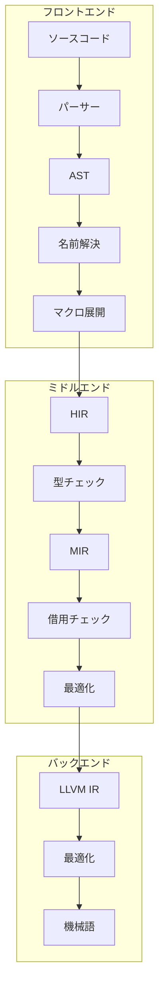

# コンポーネント詳細

このセクションでは、Rustコンパイラの主要コンポーネントについて深く学習します。各コンポーネントの役割、実装、そして相互作用を理解することで、より効果的な貢献ができるようになります。

## コンパイラの主要コンポーネント

### 1. フロントエンドコンポーネント

#### パーサーと構文解析

**役割**: ソースコードを抽象構文木（AST）に変換

**主要なファイル**:

- `src/libsyntax/parse/` - 字句解析と構文解析
- `src/libsyntax/ast/` - ASTの定義
- `src/libsyntax/expand/` - マクロ展開

**学習ポイント**:

```rust
// ASTの構造例
pub struct Expr {
    pub id: NodeId,
    pub kind: ExprKind,
    pub span: Span,
    pub attrs: ThinVec<Attribute>,
}

// 式の種類
pub enum ExprKind {
    Box { expr: P<Expr> },
    Array { elems: ThinVec<P<Expr>> },
    Call { func: P<Expr>, args: ThinVec<P<Expr>> },
    // ... 他の式の種類
}
```

**実践的な理解**:

- ASTの構造を理解する
- パーサーのエラー処理を学ぶ
- マクロ展開のプロセスを追う

#### 名前解決

**役割**: 識別子の定義と使用を関連付け

**主要なファイル**:

- `src/librustc_resolve/` - 名前解決の実装
- `src/librustc_hir/lowering.rs` - HIRへの変換

**学習ポイント**:

```rust
// 名前解決の結果
pub struct Resolution {
    pub def_id: DefId,
    pub depth: usize,
    pub is_import: bool,
}

// モジュールの階層構造
struct ModuleData {
    parent: Option<Module<'a>>,
    children: FxHashMap<Ident, Module<'a>>,
    resolutions: FxHashMap<Ident, Resolution>,
}
```

**実践的な理解**:

- モジュールの階層構造を理解する
- インポートの解決プロセスを学ぶ
- 名前空間の管理を理解する

### 2. ミドルエンドコンポーネント

#### 型チェックと型推論

**役割**: 型の整合性を検証し、型を推論

**主要なファイル**:

- `src/librustc_typeck/` - 型チェックの実装
- `src/librustc_infer/` - 型推論
- `src/librustc_ty/` - 型の表現

**学習ポイント**:

```rust
// 型の表現
pub struct Ty<'tcx> {
    kind: TyKind<'tcx>,
}

// 型の種類
pub enum TyKind<'tcx> {
    Bool,
    Char,
    Int(IntTy),
    Uint(UintTy),
    Float(FloatTy),
    Adt(AdtDef<'tcx>, SubstsRef<'tcx>),
    // ... 他の型の種類
}

// 型推論の制約
pub struct TypeVariableId {
    pub index: u32,
}

pub enum Constraint<'tcx> {
    InferConstrain(Vec<Ty<'tcx>>),
    Subtype(Ty<'tcx>, Ty<'tcx>),
}
```

**実践的な理解**:

- 型推論アルゴリズムを理解する
- 制約収集と解決のプロセスを学ぶ
- 型エラーの報告メカニズムを理解する

#### HIRからMIRへの変換

**役割**: 高レベル中間表現を中レベル中間表現に変換

**主要なファイル**:

- `src/librustc_mir/build/` - MIRの構築
- `src/librustc_mir/` - MIRの定義と操作
- `src/librustc_thir/` - THIRの定義

**学習ポイント**:

```rust
// MIRの基本構造
pub struct Body<'tcx> {
    pub basic_blocks: IndexVec<BasicBlock, BasicBlockData<'tcx>>,
    pub local_decls: IndexVec<Local, LocalDecl<'tcx>>,
    pub user_type_annotations: IndexVec<UserTypeAnnotationIndex, UserTypeAnnotation>,
    pub arg_count: usize,
    pub span: Span,
}

// 基本ブロック
pub struct BasicBlockData<'tcx> {
    pub statements: Vec<Statement<'tcx>>,
    pub terminator: Option<Terminator<'tcx>>,
    pub is_cleanup: bool,
}

// ステートメントとターミネータ
pub enum StatementKind<'tcx> {
    Assign { place: Place<'tcx>, rvalue: Rvalue<'tcx> },
    FakeRead { cause: FakeReadCause, place: Place<'tcx> },
    // ... 他のステートメント
}

pub enum TerminatorKind<'tcx> {
    Goto { target: BasicBlock },
    SwitchInt { discr: Operand<'tcx>, targets: SwitchTargets },
    Resume,
    Abort,
    Return,
    // ... 他のターミネータ
}
```

**実践的な理解**:

- MIRの構築プロセスを理解する
- 制御フローグラフの構造を学ぶ
- 最適化のための中間表現を理解する

#### 借用チェック

**役割**: 所有権と借用のルールを検証

**主要なファイル**:

- `src/librustc_borrowck/` - 借用チェックの実装
- `src/librustc_mir/borrow_check.rs` - MIRレベルの借用チェック

**学習ポイント**:

```rust
// 借用の種類
pub enum BorrowKind {
    Shared,
    Mut { allow_two_phase_borrow: bool },
    Unique,
}

// 借用データ
pub struct BorrowData<'tcx> {
    pub kind: BorrowKind,
    pub place: Place<'tcx>,
    pub region: RegionVid,
}

// 借用チェックの結果
pub struct BorrowckResults<'tcx> {
    pub consumer_moves: FxHashSet<Place<'tcx>>,
    pub used_mut_nodes: FxHashSet<Local>,
    pub region_inference_results: RegionInferenceResults<'tcx>,
}
```

**実践的な理解**:

- 借用チェックアルゴリズムを理解する
- ライフタイムの推論と検証を学ぶ
- 借用エラーの検出と報告を理解する

### 3. バックエンドコンポーネント

#### コード生成

**役割**: MIRをLLVM IRに変換し、機械語を生成

**主要なファイル**:

- `src/librustc_codegen_llvm/` - LLVMコード生成
- `src/librustc_codegen_ssa/` - SSA形式への変換
- `src/librustc_mir/interpret/` - 定数評価

**学習ポイント**:

```rust
// LLVM IRへの変換
pub struct CodegenCx<'ll, 'tcx> {
    pub llcx: &'ll llvm::Context,
    pub llmod: &'ll llvm::Module,
    pub builder: Builder<'ll>,
    pub tcx: TyCtxt<'tcx>,
}

// 値の表現
pub enum Value<'ll> {
    Function(&'ll llvm::Value),
    LValue(&'ll llvm::Value),
    RValue(&'ll llvm::Value),
}

// 型の変換
pub fn type_of<'ll, 'tcx>(cx: &CodegenCx<'ll, 'tcx>, ty: Ty<'tcx>) -> &'ll llvm::Type {
    match ty.kind() {
        TyKind::Bool => cx.type_i1(),
        TyKind::Int(int_ty) => cx.type_from_int(int_ty),
        TyKind::Uint(uint_ty) => cx.type_from_uint(uint_ty),
        // ... 他の型の変換
    }
}
```

**実践的な理解**:

- LLVM IRの構造と生成を学ぶ
- ターゲット依存のコード生成を理解する
- 最適化パスの適用を学ぶ

## コンポーネント間の相互作用

### データフローと制御フロー



### クエリシステムによる連携

```rust
// クエリの定義例
rustc_queries! {
    Other {
        fn type_of(def_id: DefId) -> Ty<'tcx>;
        fn impls_of_trait(def_id: DefId) -> &'tcx [DefId];
        fn mir_built(def_id: DefId) -> Body<'tcx>;
        fn mir_optimized(def_id: DefId) -> Body<'tcx>;
    }
}

// クエリの実装
impl<'tcx> Queries<'tcx> {
    pub fn type_of(&self, def_id: DefId) -> Ty<'tcx> {
        self.type_of(def_id)
    }
}
```

## 実践的な学習アプローチ

### 1. 特定コンポーネントの選択

#### 選択基準

- **興味と関心**: 最も興味のある分野
- **スキルセット**: 既存の知識や経験
- **コミュニティのニーズ**: 貢献の機会が多い分野
- **学習目標**: 達成したい具体的な目標

#### おすすめの学習順序

1. **型チェック**: 多くのコンパイラ概念が含まれる
2. **MIR**: 中間表現の理解に重要
3. **パーサー**: 構文解析の基礎を学ぶ
4. **コード生成**: バックエンドの仕組みを理解

### 2. コードリーディングの技術

#### 効果的な読み方

- **トップダウン**: 高レベルな構造から理解
- **ボトムアップ**: 具体的な実装から理解
- **トレーシング**: 実際の実行を追跡
- **テストケース**: 既存のテストから理解

#### 読むべきファイルの優先順位

1. **パブリックAPI**: コンポーネントの外部インターフェース
2. **主要な構造体**: データ構造の定義
3. **主要な関数**: コアな処理の実装
4. **テスト**: 使用例と期待される振る舞い

### 3. 実践的な演習

#### 簡単な変更から始める

```rust
// 例: 新しい警告の追加
pub struct UnusedVariableWarning {
    pub span: Span,
    pub name: Ident,
}

// 実装
impl<'tcx> LateLintPass<'tcx> for UnusedVariableWarning {
    fn check_local(&mut self, cx: &LateContext<'tcx>, local: &Local) {
        if !local.pat.is_placeholder() && !local.attrs.is_empty() {
            // 未使用の変数チェック
        }
    }
}
```

#### 既存の機能の拡張

```rust
// 例: 新しい最適化パスの追加
pub struct DeadCodeElimination;

impl<'tcx> MirPass<'tcx> for DeadCodeElimination {
    fn run_pass(&self, tcx: TyCtxt<'tcx>, body: &mut Body<'tcx>) {
        // デッドコード削除の実装
    }
}
```

## デバッグと問題解決

### コンポーネント特有のデバッグ手法

#### 型チェックのデバッグ

```bash
# 型推論の詳細な出力
rustc -Z verbose -Z borrowck=mir

# 型チェックのトレース
rustc -Z trace-macros -Z dump-mir=all
```

#### MIRのデバッグ

```bash
# MIRのダンプ
rustc -Z dump-mir=all -Z mir-opt-level=0

# MIRの可視化
rustc -Z dump-mir=graphviz
```

#### パーサーのデバッグ

```bash
# パースツリーの出力
rustc -Z parse-tree

# トークンの出力
rustc -Z ast-json
```

### よくある問題と解決方法

#### 1. 型推論の失敗

- **原因**: 制約の矛盾や不足
- **解決**: 制約の収集ロジックを確認
- **ツール**: 型チェックの詳細なログ

#### 2. MIRの不正な状態

- **原因**: 変換時のエラーや最適化のバグ
- **解決**: MIRの検証ルールを確認
- **ツール**: MIRの可視化と検証

#### 3. コード生成のエラー

- **原因**: LLVM IRの不正な生成
- **解決**: LLVM IRの検証と修正
- **ツール**: LLVMのデバッグツール

## 関連ドキュメント

より詳細な情報については、以下のドキュメントを参照してください：

- [ソースコード表現](../../part-3-intro.md) - AST、HIR、MIRの詳細
- [解析](../../part-4-intro.md) - 型チェックと型推論
- [MIRからバイナリへ](../../part-5-intro.md) - 最適化とコード生成
- [クエリ：デマンド駆動コンパイル](../../query.md) - クエリシステム
- [コンパイラのデバッグ](../../compiler-debugging.md) - デバッグ手法

## 次のステップ

コンポーネントの詳細を理解したら、次は[デバッグ手法](./debugging.md)を学びましょう。効果的なデバッグ技術を身につけることで、より複雑な問題に対応できるようになります。
