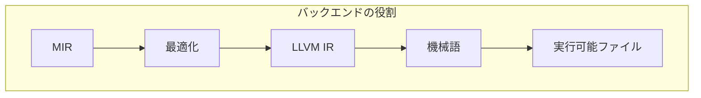

# バックエンド

このセクションでは、Rustコンパイラのバックエンド開発について深く学習します。LLVMとの統合、新しいターゲットのサポート、コード生成の最適化など、低レベルな実装技術を習得しましょう。

## バックエンドの概要

### バックエンドの役割と特徴

#### 1. 中間表現から機械語への変換



**主要な役割**:

- **コード生成**: MIRをターゲット機械語に変換
- **最適化**: ターゲット特有の最適化を適用
- **リンク**: オブジェクトファイルのリンクと実行可能ファイルの生成
- **デバッグ情報**: デバッグ情報の生成と埋め込み

#### 2. バックエンドの種類

| 種類 | 特徴 | 用途 |
|------|------|------|
| LLVMバックエンド | 最も一般的、多くのターゲットをサポート | 一般的なコンパイル |
| Craneliftバックエンド | Rust実装、高速なコンパイル | 開発時のコンパイル |
| GCCバックエンド | GCCの最適化を活用 | 特定の組み込み環境 |
| WebAssemblyバックエンド | Webブラウザでの実行 | Webアプリケーション |

### 3. ターゲットアーキテクチャのサポート

#### 主要なターゲット

```rust
// ターゲットの定義
pub enum TargetTriple {
    X86_64,
    X86_32,
    ARM64,
    ARM32,
    RISCV64,
    WebAssembly,
    // ... 他のターゲット
}

impl TargetTriple {
    pub fn from_str(s: &str) -> Result<Self, TargetError> {
        match s {
            "x86_64-unknown-linux-gnu" => Ok(TargetTriple::X86_64),
            "aarch64-unknown-linux-gnu" => Ok(TargetTriple::ARM64),
            "wasm32-unknown-unknown" => Ok(TargetTriple::WebAssembly),
            // ... 他のターゲット文字列
            _ => Err(TargetError::UnknownTarget(s.to_string())),
        }
    }
}
```

#### ターゲット特有の設定

```rust
// ターゲット設定の構造
pub struct TargetConfig {
    pub triple: TargetTriple,
    pub cpu: String,
    pub features: Vec<String>,
    pub opts: CodegenOpts,
}

// ターゲット特有の最適化
impl TargetConfig {
    pub fn optimize_for_target(&self, mir: &mut Mir) {
        match self.triple {
            TargetTriple::X86_64 => {
                self.optimize_for_x86_64(mir);
            }
            TargetTriple::ARM64 => {
                self.optimize_for_arm64(mir);
            }
            TargetTriple::WebAssembly => {
                self.optimize_for_wasm(mir);
            }
            // ... 他のターゲット
        }
    }
}
```

## LLVMバックエンド

### 1. LLVMとの統合

#### LLVMコンテキストの初期化

```rust
// LLVMコンテキストの作成
pub struct LlvmContext<'a> {
    context: &'a llvm::Context,
    module: &'a llvm::Module,
    builder: Builder<'a>,
}

impl<'a> LlvmContext<'a> {
    pub fn new() -> Self {
        let context = llvm::Context::create();
        let module = context.create_module("rust_module");
        let builder = context.create_builder();
        
        Self {
            context,
            module,
            builder,
        }
    }
    
    pub fn target_data(&self, triple: &TargetTriple) -> TargetData {
        let triple_str = triple.to_string();
        let llvm_triple = llvm::Target::get_triple(&triple_str);
        let target_machine = llvm::Target::create_target_machine(
            llvm_triple,
            "", // CPU名（空でデフォルト）
            "", // 機能文字列（空でデフォルト）
            llvm::CodeGenOptLevel::Aggressive,
            llvm::RelocMode::PIC,
            llvm::CodeModel::Default,
        ).expect("Failed to create target machine");
        
        TargetData {
            triple,
            target_machine,
        }
    }
}
```

#### 型の変換

```rust
// Rust型からLLVM型への変換
impl<'a, 'tcx> LlvmTypeConverter<'a, 'tcx> {
    pub fn ty_to_llvm_type(&self, ty: Ty<'tcx>) -> &'a llvm::Type {
        match ty.kind() {
            TyKind::Bool => self.context.i1_type(),
            TyKind::Char => self.context.i8_type(),
            TyKind::Int(int_ty) => match int_ty.bit_width() {
                8 => self.context.i8_type(),
                16 => self.context.i16_type(),
                32 => self.context.i32_type(),
                64 => self.context.i64_type(),
                _ => panic!("Unsupported integer width"),
            },
            TyKind::Uint(uint_ty) => match uint_ty.bit_width() {
                8 => self.context.i8_type(),
                16 => self.context.i16_type(),
                32 => self.context.u32_type(),
                64 => self.context.u64_type(),
                _ => panic!("Unsupported integer width"),
            },
            TyKind::Float(float_ty) => match float_ty.bit_width() {
                32 => self.context.f32_type(),
                64 => self.context.f64_type(),
                _ => panic!("Unsupported float width"),
            },
            TyKind::Adt(adt, substs) => {
                self.adt_to_llvm_type(adt, substs)
            },
            TyKind::Tuple(types) => {
                self.tuple_to_llvm_type(types)
            },
            TyKind::Array(elem_ty, len) => {
                self.array_to_llvm_type(elem_ty, len)
            },
            TyKind::Slice(elem_ty) => {
                self.slice_to_llvm_type(elem_ty)
            },
            // ... 他の型
        }
    }
    
    fn adt_to_llvm_type(&self, adt: AdtDef<'tcx>, substs: SubstsRef<'tcx>) -> &'a llvm::Type {
        // 構造体のLLVM型の作成
        let field_types: Vec<&'a llvm::Type> = adt.variants
            .iter()
            .flat_map(|variant| {
                variant.fields.iter().map(|field| {
                    let field_ty = field.ty(self.tcx, substs);
                    self.ty_to_llvm_type(field_ty)
                })
            })
            .collect();
        
        self.context.struct_type(&field_types, false)
    }
}
```

### 2. MIRからLLVM IRへの変換

#### 基本的な変換プロセス

```rust
// MIRからLLVM IRへの変換
pub struct MirToLlvmConverter<'a, 'tcx> {
    llvm_ctx: LlvmContext<'a>,
    tcx: TyCtxt<'tcx>,
    function_map: HashMap<BasicBlock, &'a llvm::BasicValue>,
    local_map: HashMap<Local, &'a llvm::BasicValue>,
}

impl<'a, 'tcx> MirToLlvmConverter<'a, 'tcx> {
    pub fn convert_function(&mut self, mir: &Body<'tcx>) -> &'a llvm::Value {
        // 1. 関数シグネチャの定義
        let fn_type = self.convert_function_signature(mir);
        let function = self.llvm_ctx.module.add_function(
            "function_name",
            fn_type,
            None,
        );
        
        // 2. 基本ブロックの変換
        for (bb_id, bb_data) in mir.basic_blocks.iter_enumerated() {
            let llvm_bb = function.append_basic_block(&format!("bb_{}", bb_id));
            self.function_map.insert(bb_id, llvm_bb);
            
            self.convert_basic_block(function, bb_id, bb_data);
        }
        
        function.as_global_value().as_value()
    }
    
    fn convert_basic_block(
        &mut self,
        function: &'a llvm::Function,
        bb_id: BasicBlock,
        bb_data: &BasicBlockData<'tcx>,
    ) {
        let llvm_bb = self.function_map[&bb_id];
        self.llvm_ctx.builder.position_at_end(llvm_bb);
        
        // 3. ステートメントの変換
        for statement in &bb_data.statements {
            self.convert_statement(statement);
        }
        
        // 4. ターミネータの変換
        if let Some(terminator) = &bb_data.terminator {
            self.convert_terminator(function, terminator);
        }
    }
    
    fn convert_statement(&mut self, statement: &Statement<'tcx>) {
        match &statement.kind {
            StatementKind::Assign(place, rvalue) => {
                let llvm_value = self.convert_rvalue(rvalue);
                let llvm_place = self.convert_place(place);
                self.llvm_ctx.builder.build_store(llvm_value, llvm_place);
            }
            StatementKind::SetDiscriminant(place, discr) => {
                let llvm_discr = self.convert_discriminant(discr);
                let llvm_place = self.convert_place(place);
                self.llvm_ctx.builder.build_store(llvm_discr, llvm_place);
            }
            // ... 他のステートメント
        }
    }
    
    fn convert_terminator(
        &mut self,
        function: &'a llvm::Function,
        terminator: &Terminator<'tcx>,
    ) {
        match &terminator.kind {
            TerminatorKind::Goto { target } => {
                let target_bb = self.function_map[target];
                self.llvm_ctx.builder.build_br(target_bb);
            }
            TerminatorKind::SwitchInt { discr, targets } => {
                let llvm_discr = self.convert_operand(discr);
                let llvm_targets: Vec<&'a llvm::BasicBlock> = targets
                    .targets
                    .iter()
                    .map(|(_, target)| self.function_map[target])
                    .collect();
                
                let otherwise_bb = self.function_map[targets.otherwise()];
                
                self.llvm_ctx.builder.build_switch(
                    llvm_discr,
                    otherwise_bb,
                    &llvm_targets,
                );
            }
            TerminatorKind::Return { value } => {
                let llvm_value = self.convert_operand(value);
                self.llvm_ctx.builder.build_ret(llvm_value);
            }
            // ... 他のターミネータ
        }
    }
}
```

#### 値の変換

```rust
// MIR値からLLVM値への変換
impl<'a, 'tcx> MirToLlvmConverter<'a, 'tcx> {
    fn convert_operand(&mut self, operand: &Operand<'tcx>) -> &'a llvm::BasicValue {
        match operand {
            Operand::Copy(place) => {
                let llvm_place = self.convert_place(place);
                self.llvm_ctx.builder.build_load(llvm_place, "copy")
            }
            Operand::Move(place) => {
                let llvm_place = self.convert_place(place);
                self.llvm_ctx.builder.build_load(llvm_place, "move")
            }
            Operand::Constant(constant) => {
                self.convert_constant(constant)
            }
        }
    }
    
    fn convert_rvalue(&mut self, rvalue: &Rvalue<'tcx>) -> &'a llvm::BasicValue {
        match rvalue {
            Rvalue::Use(operand) => self.convert_operand(operand),
            Rvalue::BinaryOp(bin_op, left, right) => {
                let llvm_left = self.convert_operand(left);
                let llvm_right = self.convert_operand(right);
                
                match bin_op {
                    BinOp::Add => self.llvm_ctx.builder.build_add(llvm_left, llvm_right, "add"),
                    BinOp::Sub => self.llvm_ctx.builder.build_sub(llvm_left, llvm_right, "sub"),
                    BinOp::Mul => self.llvm_ctx.builder.build_mul(llvm_left, llvm_right, "mul"),
                    // ... 他の二項演算
                }
            }
            Rvalue::UnaryOp(un_op, operand) => {
                let llvm_operand = self.convert_operand(operand);
                
                match un_op {
                    UnOp::Neg => self.llvm_ctx.builder.build_neg(llvm_operand, "neg"),
                    UnOp::Not => self.llvm_ctx.builder.build_not(llvm_operand, "not"),
                    // ... 他の単項演算
                }
            }
            // ... 他の右辺値
        }
    }
    
    fn convert_constant(&mut self, constant: &Constant<'tcx>) -> &'a llvm::BasicValue {
        match constant {
            Constant::Int(int_const) => {
                let value = int_const.eval_bits(self.tcx);
                let llvm_type = self.llvm_ctx.ty_to_llvm_type(int_const.ty);
                self.llvm_ctx.const_int(llvm_type, value as u64, false)
            }
            Constant::Float(float_const) => {
                let value = float_const.eval_bits(self.tcx);
                let llvm_type = self.llvm_ctx.ty_to_llvm_type(float_const.ty);
                self.llvm_ctx.const_real(llvm_type, value)
            }
            // ... 他の定数
        }
    }
}
```

### 3. 最適化の適用

#### LLVM最適化パス

```rust
// LLVM最適化の適用
pub struct LlvmOptimizer<'a> {
    module: &'a llvm::Module,
    target_machine: &'a llvm::TargetMachine,
}

impl<'a> LlvmOptimizer<'a> {
    pub fn optimize(&self, optimization_level: OptimizationLevel) {
        let pass_manager = llvm::PassManager::create();
        
        match optimization_level {
            OptimizationLevel::None => {
                // 最適化なし
            }
            OptimizationLevel::Basic => {
                self.add_basic_optimizations(&pass_manager);
            }
            OptimizationLevel::Aggressive => {
                self.add_aggressive_optimizations(&pass_manager);
            }
        }
        
        pass_manager.run(&self.module);
    }
    
    fn add_basic_optimizations(&self, pm: &mut llvm::PassManager) {
        pm.add_instruction_combining_pass();
        pm.add_reassociate_pass();
        pm.add_gvn_pass();
        pm.add_cfg_simplification_pass();
        pm.add_dead_code_elimination_pass();
    }
    
    fn add_aggressive_optimizations(&self, pm: &mut llvm::PassManager) {
        self.add_basic_optimizations(pm);
        
        pm.add_loop_vectorize_pass();
        pm.add_slp_vectorizer_pass();
        pm.add_loop_unroll_pass();
        pm.add_function_inlining_pass();
        pm.add_constant_propagation_pass();
    }
}
```

## 新しいバックエンドの実装

### 1. Craneliftバックエンド

#### Craneliftの基本構造

```rust
// Craneliftバックエンドの実装
pub struct CraneliftBackend<'tcx> {
    tcx: TyCtxt<'tcx>,
    context: cranelift_codegen::Context,
    isa: cranelift::isa::TargetIsa,
}

impl<'tcx> CraneliftBackend<'tcx> {
    pub fn new(tcx: TyCtxt<'tcx>) -> Self {
        let isa = cranelift::isa::lookup(triple!("x86_64"))
            .expect("Failed to create ISA");
        
        let context = cranelift_codegen::Context::new();
        
        Self {
            tcx,
            context,
            isa,
        }
    }
    
    pub fn compile_function(&mut self, mir: &Body<'tcx>) -> Vec<u8> {
        // 1. Cranelift関数の構築
        let mut clif = self.context.build_function();
        
        // 2. MIRからCranelift IRへの変換
        self.convert_mir_to_clif(&mut clif, mir);
        
        // 3. Craneliftの最適化
        self.optimize_clif(&mut clif);
        
        // 4. 機械語への変換
        let compiled = self.context.compile(&clif, &self.isa);
        
        compiled.buffer.to_vec()
    }
    
    fn convert_mir_to_clif(&self, clif: &mut cranelift_codegen::Function, mir: &Body<'tcx>) {
        // MIRの基本ブロックを変換
        for (bb_id, bb_data) in mir.basic_blocks.iter_enumerated() {
            let clif_block = clif.create_block();
            
            // ステートメントの変換
            for statement in &bb_data.statements {
                self.convert_statement_to_clif(clif, statement);
            }
            
            // ターミネータの変換
            if let Some(terminator) = &bb_data.terminator {
                self.convert_terminator_to_clif(clif, terminator);
            }
            
            clif.append_block(clif_block);
        }
    }
}
```

### 2. WebAssemblyバックエンド

#### WebAssemblyの特有な考慮

```rust
// WebAssemblyバックエンドの実装
pub struct WebAssemblyBackend<'tcx> {
    tcx: TyCtxt<'tcx>,
    module: wasm_encoder::Module,
}

impl<'tcx> WebAssemblyBackend<'tcx> {
    pub fn new(tcx: TyCtxt<'tcx>) -> Self {
        Self {
            tcx,
            module: wasm_encoder::Module::new(),
        }
    }
    
    pub fn compile_function(&mut self, mir: &Body<'tcx>) -> Vec<u8> {
        // 1. WebAssemblyモジュールの構築
        self.build_wasm_function(mir);
        
        // 2. WebAssemblyのエンコード
        self.module.encode()
    }
    
    fn build_wasm_function(&mut self, mir: &Body<'tcx>) {
        // WebAssembly関数の定義
        let func_type = self.convert_function_signature(mir);
        let func_id = self.module.add_function(&func_type);
        
        // WebAssemblyローカル変数の定義
        let mut local_map = HashMap::new();
        for (local_id, local_decl) in mir.local_decls.iter_enumerated() {
            let wasm_type = self.convert_type(local_decl.ty);
            let wasm_local = self.module.add_local(wasm_type);
            local_map.insert(local_id, wasm_local);
        }
        
        // WebAssembly命令の生成
        for (bb_id, bb_data) in mir.basic_blocks.iter_enumerated() {
            self.build_wasm_block(&mut local_map, bb_id, bb_data);
        }
    }
    
    fn build_wasm_block(
        &mut self,
        local_map: &mut HashMap<Local, wasm_encoder::Local>,
        bb_id: BasicBlock,
        bb_data: &BasicBlockData<'tcx>,
    ) {
        // WebAssembly基本ブロックの構築
        for statement in &bb_data.statements {
            self.convert_statement_to_wasm(&mut local_map, statement);
        }
        
        if let Some(terminator) = &bb_data.terminator {
            self.convert_terminator_to_wasm(&mut local_map, terminator);
        }
    }
    
    fn convert_statement_to_wasm(
        &mut self,
        local_map: &mut HashMap<Local, wasm_encoder::Local>,
        statement: &Statement<'tcx>,
    ) {
        match &statement.kind {
            StatementKind::Assign(place, rvalue) => {
                let wasm_value = self.convert_rvalue_to_wasm(&mut local_map, rvalue);
                let wasm_place = self.convert_place_to_wasm(&mut local_map, place);
                self.module.instruction(wasm_encoder::Instruction::LocalSet {
                    local: wasm_place,
                    value: wasm_value,
                });
            }
            // ... 他のステートメント
        }
    }
}
```

## リンクと実行可能ファイルの生成

### 1. オブジェクトファイルの生成

#### オブジェクトファイルの書き出し

```rust
// オブジェクトファイルの生成
pub struct ObjectFileGenerator {
    target: TargetTriple,
    objects: Vec<ObjectFile>,
}

impl ObjectFileGenerator {
    pub fn write_object_file(&self, compiled_code: &[u8], filename: &str) -> Result<(), IoError> {
        let object_file = ObjectFile {
            target: self.target.clone(),
            code: compiled_code.to_vec(),
            symbols: self.collect_symbols(compiled_code),
            relocations: self.collect_relocations(compiled_code),
        };
        
        // オブジェクトファイルの書き出し
        let mut file = std::fs::File::create(filename)?;
        self.write_object_header(&mut file, &object_file)?;
        self.write_code_section(&mut file, &object_file)?;
        self.write_symbol_table(&mut file, &object_file)?;
        self.write_relocation_table(&mut file, &object_file)?;
        
        Ok(())
    }
    
    fn write_object_header(&self, file: &mut File, obj: &ObjectFile) -> Result<(), IoError> {
        // マジックナンバーの書き込み
        file.write_all(b"\x7FELF")?;
        
        // ターゲット情報の書き込み
        self.write_target_info(file, &obj.target)?;
        
        // セクションヘッダの書き込み
        file.write_all(&obj.sections.header)?;
        
        Ok(())
    }
}
```

### 2. 実行可能ファイルのリンク

#### リンカの呼び出し

```rust
// リンカの統合
pub struct Linker {
    target: TargetTriple,
    objects: Vec<PathBuf>,
    libraries: Vec<String>,
    output_path: PathBuf,
}

impl Linker {
    pub fn link(&self) -> Result<(), LinkError> {
        let mut cmd = match self.target {
            TargetTriple::X86_64 => {
                std::process::Command::new("ld")
            }
            TargetTriple::ARM64 => {
                std::process::Command::new("ld.lld")
            }
            TargetTriple::WebAssembly => {
                std::process::Command::new("wasm-ld")
            }
            _ => return Err(LinkError::UnsupportedTarget(self.target)),
        };
        
        // リンカ引数の設定
        cmd.arg("-o").arg(&self.output_path);
        
        for object in &self.objects {
            cmd.arg(object);
        }
        
        for library in &self.libraries {
            cmd.arg(format!("-l{}", library));
        }
        
        // リンクの実行
        let output = cmd.output()?;
        
        if !output.status.success() {
            return Err(LinkError::LinkFailed {
                stderr: String::from_utf8_lossy(&output.stderr),
                exit_code: output.status.code(),
            });
        }
        
        Ok(())
    }
}
```

## デバッグ情報の生成

### 1. デバッグシンボルの生成

#### DWARFデバッグ情報

```rust
// DWARFデバッグ情報の生成
pub struct DebugInfoGenerator<'tcx> {
    tcx: TyCtxt<'tcx>,
    debug_info: DebugInfo,
}

impl<'tcx> DebugInfoGenerator<'tcx> {
    pub fn generate_debug_info(&mut self, mir: &Body<'tcx>) -> DebugInfo {
        let mut debug_info = DebugInfo::new();
        
        // 1. コンパイル単位の情報
        let compile_unit = self.create_compile_unit(mir);
        debug_info.add_compile_unit(compile_unit);
        
        // 2. 関数のデバッグ情報
        let function_info = self.create_function_info(mir);
        debug_info.add_function(function_info);
        
        // 3. 変数のデバッグ情報
        for (local_id, local_decl) in mir.local_decls.iter_enumerated() {
            let variable_info = self.create_variable_info(local_id, local_decl);
            debug_info.add_variable(variable_info);
        }
        
        // 4. 型のデバッグ情報
        self.add_type_debug_info(&mut debug_info, mir);
        
        debug_info
    }
    
    fn create_function_info(&self, mir: &Body<'tcx>) -> FunctionDebugInfo {
        FunctionDebugInfo {
            name: self.get_function_name(mir),
            low_pc: 0, // 開始アドレス
            high_pc: mir.basic_blocks.len() as u64, // 終了アドレス
            line_table: self.create_line_table(mir),
            local_variables: Vec::new(),
        }
    }
    
    fn create_variable_info(&self, local_id: Local, local_decl: &LocalDecl<'tcx>) -> VariableDebugInfo {
        VariableDebugInfo {
            name: self.get_variable_name(local_id),
            type_info: self.convert_type_to_debug(local_decl.ty),
            location: self.get_variable_location(local_id),
            scope: self.get_variable_scope(local_id),
        }
    }
}
```

### 2. ソースマップの生成

#### ソースコード位置のマッピング

```rust
// ソースマップの生成
pub struct SourceMapGenerator {
    source_files: HashMap<FileName, SourceFile>,
    locations: Vec<LocationInfo>,
}

impl SourceMapGenerator {
    pub fn generate_source_map(&mut self, mir: &Body) -> SourceMap {
        let mut source_map = SourceMap::new();
        
        // 1. ソースファイルの登録
        for span in self.collect_spans(mir) {
            let file_name = self.get_file_name(span);
            if !self.source_files.contains_key(&file_name) {
                let source_file = self.load_source_file(&file_name);
                self.source_files.insert(file_name, source_file);
            }
        }
        
        // 2. 位置情報の収集
        for (bb_id, bb_data) in mir.basic_blocks.iter_enumerated() {
            for statement in &bb_data.statements {
                let location = LocationInfo {
                    span: statement.span,
                    file: self.get_file_name(statement.span),
                    line: self.get_line_number(statement.span),
                    column: self.get_column_number(statement.span),
                };
                self.locations.push(location);
            }
        }
        
        // 3. ソースマップの構築
        source_map.build(self.source_files.clone(), self.locations.clone());
        
        source_map
    }
}
```

## パフォーマンス最適化

### 1. コード生成の最適化

#### 効率的なコード生成

```rust
// 効率的なコード生成
pub struct OptimizedCodeGenerator<'tcx> {
    tcx: TyCtxt<'tcx>,
    optimization_level: OptimizationLevel,
}

impl<'tcx> OptimizedCodeGenerator<'tcx> {
    pub fn generate_optimized_code(&mut self, mir: &Body<'tcx>) -> Vec<u8> {
        match self.optimization_level {
            OptimizationLevel::None => {
                self.generate_code_without_optimization(mir)
            }
            OptimizationLevel::Size => {
                self.generate_size_optimized_code(mir)
            }
            OptimizationLevel::Speed => {
                self.generate_speed_optimized_code(mir)
            }
        }
    }
    
    fn generate_size_optimized_code(&mut self, mir: &Body<'tcx>) -> Vec<u8> {
        // 1. デッドコードの削除
        let mut optimizer = DeadCodeElimination::new(mir);
        optimizer.run();
        
        // 2. 不要な変数の削除
        let mut optimizer = VariableElimination::new(mir);
        optimizer.run();
        
        // 3. 定数伝播
        let mut optimizer = ConstantPropagation::new(mir);
        optimizer.run();
        
        // 4. コード生成
        self.generate_code_from_optimized_mir(mir)
    }
    
    fn generate_speed_optimized_code(&mut self, mir: &Body<'tcx>) -> Vec<u8> {
        // 1. ループの最適化
        let mut optimizer = LoopOptimizer::new(mir);
        optimizer.optimize_for_speed();
        
        // 2. 関数のインライン化
        let mut optimizer = InliningOptimizer::new(mir);
        optimizer.optimize_for_speed();
        
        // 3. ベクトル化
        let mut optimizer = Vectorizer::new(mir);
        optimizer.optimize_for_speed();
        
        // 4. コード生成
        self.generate_code_from_optimized_mir(mir)
    }
}
```

### 2. メモリ使用量の最適化

#### メモリ効率的なコード生成

```rust
// メモリ効率的なコード生成
pub struct MemoryEfficientGenerator<'tcx> {
    tcx: TyCtxt<'tcx>,
    memory_pool: MemoryPool,
}

impl<'tcx> MemoryEfficientGenerator<'tcx> {
    pub fn generate_memory_efficient_code(&mut self, mir: &Body<'tcx>) -> Vec<u8> {
        // 1. メモリプールの初期化
        self.memory_pool.reset();
        
        // 2. レジスタ割り当ての最適化
        let register_allocator = self.optimize_register_allocation(mir);
        
        // 3. スタックフレームの最適化
        let stack_layout = self.optimize_stack_layout(mir);
        
        // 4. メモリ使用量の最小化
        let mut optimizer = MemoryOptimizer::new(mir);
        optimizer.minimize_memory_usage();
        
        // 5. コード生成
        self.generate_code_with_memory_constraints(mir, register_allocator, stack_layout)
    }
    
    fn optimize_register_allocation(&self, mir: &Body<'tcx>) -> RegisterAllocator {
        let mut allocator = RegisterAllocator::new();
        
        // レジスタの干渉解析
        let interference_graph = self.build_interference_graph(mir);
        
        // グラフ彩色によるレジスタ割り当て
        allocator.allocate_registers(interference_graph);
        
        allocator
    }
    
    fn optimize_stack_layout(&self, mir: &Body<'tcx>) -> StackLayout {
        let mut layout = StackLayout::new();
        
        // 変数のライフタイム分析
        let lifetime_analysis = self.analyze_lifetimes(mir);
        
        // スタックスロットの最適化
        layout.optimize_slot_allocation(&lifetime_analysis);
        
        layout
    }
}
```

## 実践的な演習

### 1. 新しいターゲットのサポート

#### 演習1.1: RISCVターゲットの実装

**目的**: 新しいRISCVターゲットのサポートを追加する

```rust
// RISCVターゲットの実装
pub struct RiscvTarget {
    isa: riscv::isa::Isa,
    features: riscv::Features,
}

impl RiscvTarget {
    pub fn new(features: &str) -> Self {
        let mut isa = riscv::isa::Isa::base();
        
        // 機能の解析
        for feature in features.split(',') {
            match feature.trim() {
                "m" => isa = isa.with_m(),
                "a" => isa = isa.with_a(),
                "f" => isa = isa.with_f(),
                "d" => isa = isa.with_d(),
                "c" => isa = isa.with_c(),
                _ => warn!("Unknown RISCV feature: {}", feature),
            }
        }
        
        Self {
            isa,
            features: riscv::Features::from_isa(&isa),
        }
    }
    
    pub fn generate_code(&self, mir: &Body) -> Vec<u8> {
        // RISCVアセンブリコードの生成
        let mut assembler = RiscvAssembler::new();
        
        for (bb_id, bb_data) in mir.basic_blocks.iter_enumerated() {
            assembler.start_block(bb_id);
            
            for statement in &bb_data.statements {
                self.convert_statement(&mut assembler, statement);
            }
            
            if let Some(terminator) = &bb_data.terminator {
                self.convert_terminator(&mut assembler, terminator);
            }
        }
        
        assembler.finalize()
    }
    
    fn convert_statement(&self, assembler: &mut RiscvAssembler, statement: &Statement) {
        match &statement.kind {
            StatementKind::Assign(place, rvalue) => {
                let dest = self.convert_place(&assembler, place);
                let src = self.convert_rvalue(&assembler, rvalue);
                assembler.emit_mov(dest, src);
            }
            // ... 他のステートメント
        }
    }
}
```

### 2. 最適化パスの実装

#### 演習2.1: ターゲット特有の最適化

**目的**: ターゲット特有の最適化パスを実装する

```rust
// ターゲット特有の最適化
pub struct TargetSpecificOptimizations<'tcx> {
    tcx: TyCtxt<'tcx>,
    target: TargetTriple,
}

impl<'tcx> TargetSpecificOptimizations<'tcx> {
    pub fn run_target_optimizations(&mut self, mir: &mut Body<'tcx>) {
        match self.target {
            TargetTriple::X86_64 => {
                self.optimize_for_x86_64(mir);
            }
            TargetTriple::ARM64 => {
                self.optimize_for_arm64(mir);
            }
            TargetTriple::RISCV64 => {
                self.optimize_for_riscv64(mir);
            }
            _ => {
                // 一般的な最適化
                self.run_generic_optimizations(mir);
            }
        }
    }
    
    fn optimize_for_x86_64(&mut self, mir: &mut Body<'tcx>) {
        // x86_64特有の最適化
        
        // 1. SIMD命令の活用
        self.enable_vectorization(mir);
        
        // 2. 命令スケジューリングの最適化
        self.optimize_instruction_scheduling(mir);
        
        // 3. キャッシュフレンドリーなコード生成
        self.optimize_cache_behavior(mir);
    }
    
    fn enable_vectorization(&mut self, mir: &mut Body<'tcx>) {
        // ベクトル化可能なループの検出
        for bb_data in &mut mir.basic_blocks {
            if let Some(vectorizable_loop) = self.detect_vectorizable_loop(bb_data) {
                self.vectorize_loop(bb_data, vectorizable_loop);
            }
        }
    }
    
    fn detect_vectorizable_loop(&self, bb_data: &BasicBlockData<'tcx>) -> Option<VectorizableLoop> {
        // ベクトル化可能なループの検出
        if let Some(loop_info) = self.analyze_loop_structure(bb_data) {
            if self.is_vectorizable(&loop_info) {
                Some(VectorizableLoop {
                    header: loop_info.header,
                    body: loop_info.body,
                    iteration_count: loop_info.estimated_iterations,
                    vector_width: 4, // SSE2: 128-bit = 4 x 32-bit
                })
            } else {
                None
            }
        } else {
            None
        }
    }
}
```

## 関連ドキュメント

より詳細な情報については、以下のドキュメントを参照してください：

- [コード生成](../../backend/codegen.md) - コード生成の詳細
- [MIRからバイナリへ](../../part-5-intro.md) - バックエンドの概要
- [単相化](../../backend/monomorph.md) - 単相化の詳細
- [MIRの低レベル化](../../backend/lowering-mir.md) - MIRからLLVMへの変換
- [LLVMの更新](../../backend/updating-llvm.md) - LLVMの統合

## 次のステップ

バックエンド開発を学習したら、これで学習ガイドの全てのセクションを完了しました。ここで学んだ知識を実践に活かし、実際のコンパイラ開発に貢献する準備が整いました。

### まとめと次のステップ

- **理論の理解**: コンパイラの全ての主要コンポーネントを学習
- **実践的なスキル**: 実際の実装技術を習得
- **専門分野の確立**: 特定の分野での深い知識を構築
- **継続的な学習**: 最新の技術動向への追従

### おすすめの活動

1. **実際の貢献**: 学んだ知識を活かして実際のissueに挑戦
2. **新しい機能の提案**: RFCを通じて新しい機能を提案
3. **メンターシップ**: 新人開発者の指導と支援
4. **研究と発表**: 学術的な成果の発表と共有

---

これで学習ガイドの全てのセクションを完了しました。あなたのRustコンパイラ開発への貢献を心から応援しています！
