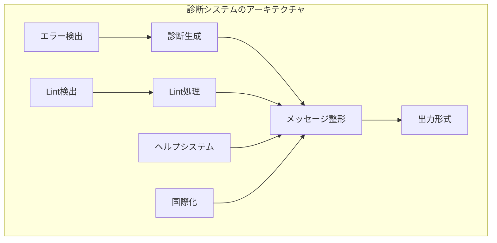

# 診断・lint

このセクションでは、Rustコンパイラの診断システムとlintの実装について深く学習します。エラーメッセージの改善、新しいlintの実装、診断システムのアーキテクチャなど、ユーザー体験を向上させるための技術を習得しましょう。

## 診断システムの概要

### 診断システムの役割

#### 1. エラー検出と報告

- **コンパイルエラー**: 文法エラー、型エラー、借用エラーなど
- **警告**: 潜在的な問題や非推奨のコードパターン
- **ヘルプメッセージ**: 問題解決のための追加情報

#### 2. ユーザー体験の向上

- **分かりやすいエラーメッセージ**: 問題の原因と解決策の明確化
- **コンテキスト情報**: エラー発生箇所の周辺コードの表示
- **修正提案**: 具体的な修正案の提示

#### 3. 開発者の支援

- **デバッグ支援**: 詳細なエラー情報の提供
- **教育機能**: エラーを通じたRustの学習支援
- **ツール統合**: IDEやエディタでのエラー表示

### 診断システムのアーキテクチャ



## 診断システムの実装

### 1. 診断の基本構造

#### 診断の定義

```rust
// src/librustc_errors/diagnostic.rs
#[derive(Clone, Debug, PartialEq, Eq)]
pub struct Diagnostic {
    pub level: Level,
    pub message: Vec<(String, Style)>,
    pub code: Option<ErrCode>,
    pub span: MultiSpan,
    pub children: Vec<SubDiagnostic>,
    pub suggestions: Vec<Suggestion>,
}

#[derive(Copy, Clone, Debug, PartialEq, Eq)]
pub enum Level {
    Bug,
    Error,
    Warning,
    Note,
    Help,
}

#[derive(Clone, Debug)]
pub struct SubDiagnostic {
    pub level: Level,
    pub message: Vec<(String, Style)>,
    pub span: MultiSpan,
}

#[derive(Clone, Debug)]
pub struct Suggestion {
    pub msg: String,
    pub span: MultiSpan,
    pub applicability: Applicability,
}
```

#### 診断の登録と使用

```rust
// src/librustc_errors/lib.rs
impl DiagnosticBuilder<'a> {
    pub fn span_err<S: Into<MultiSpan>>(&self, span: S, msg: &str) -> DiagnosticBuilder<'a> {
        self.level(Level::Error).span(span).message(msg)
    }
    
    pub fn span_warn<S: Into<MultiSpan>>(&self, span: S, msg: &str) -> DiagnosticBuilder<'a> {
        self.level(Level::Warning).span(span).message(msg)
    }
    
    pub fn help(&self, msg: &str) -> DiagnosticBuilder<'a> {
        self.level(Level::Help).message(msg)
    }
    
    pub fn note(&self, msg: &str) -> DiagnosticBuilder<'a> {
        self.level(Level::Note).message(msg)
    }
}

// 使用例
impl<'a, 'tcx> FnCtxt<'a, 'tcx> {
    pub fn report_mismatched_types(
        &self,
        span: Span,
        expected: Ty<'tcx>,
        found: Ty<'tcx>,
    ) {
        self.tcx.sess.span_err(span, &format!(
            "expected type `{}`, found type `{}`",
            self.ty_to_string(expected),
            self.ty_to_string(found)
        ))
        .span_label(span, "type mismatch")
        .help(&format!(
            "try changing the type to `{}`",
            self.ty_to_string(expected)
        ))
        .emit();
    }
}
```

### 2. エラーコードの管理

#### エラーコードの定義

```rust
// src/librustc_errors/error_codes.rs
#[derive(Clone, Copy, Debug, PartialEq, Eq, Hash)]
pub struct ErrCode {
    pub kind: ErrCodeKind,
}

#[derive(Clone, Copy, Debug, PartialEq, Eq, Hash)]
pub enum ErrCodeKind {
    // 型エラー
    E0308, // mismatched types
    E0382, // borrow of moved value
    E0505, // move out of borrowed content
    
    // ライフタイムエラー
    E0621, // explicit lifetime required
    E0716, // temporary value dropped while borrowed
    
    // 構文エラー
    E0571, // `break` inside `for` loop
    E0658, // `continue` inside `for` loop
    
    // その他のエラー
    E0001, // internal compiler error
    E0002, // etc.
}

impl ErrCode {
    pub fn as_str(&self) -> &'static str {
        match self.kind {
            ErrCodeKind::E0308 => "E0308",
            ErrCodeKind::E0382 => "E0382",
            // ... 他のエラーコード
        }
    }
    
    pub fn description(&self) -> &'static str {
        match self.kind {
            ErrCodeKind::E0308 => "mismatched types",
            ErrCodeKind::E0382 => "borrow of moved value",
            // ... 他のエラー説明
        }
    }
}
```

#### エラーコードの使用

```rust
// src/librustc_typeck/errors.rs
impl<'a, 'tcx> FnCtxt<'a, 'tcx> {
    pub fn type_mismatch_error(
        &self,
        span: Span,
        expected: Ty<'tcx>,
        found: Ty<'tcx>,
    ) -> DiagnosticBuilder<'a> {
        self.tcx.sess.span_err_with_code(
            span,
            &format!(
                "expected type `{}`, found type `{}`",
                self.ty_to_string(expected),
                self.ty_to_string(found)
            ),
            ErrCode::new(ErrCodeKind::E0308)
        )
    }
}
```

### 3. メッセージの国際化

#### 多言語対応の実装

```rust
// src/librustc_errors/translation.rs
pub struct TranslationBundle {
    locale: String,
    messages: HashMap<String, String>,
}

impl TranslationBundle {
    pub fn translate(&self, key: &str, args: &[&str]) -> String {
        if let Some(template) = self.messages.get(key) {
            let mut result = template.clone();
            for (i, arg) in args.iter().enumerate() {
                result = result.replace(&format!("{{{}}}", i), arg);
            }
            result
        } else {
            // フォールバック：英語メッセージ
            key.to_string()
        }
    }
    
    pub fn load_locale(locale: &str) -> Result<Self, TranslationError> {
        let mut messages = HashMap::new();
        
        // 翻訳ファイルの読み込み
        let translation_file = format!("locales/{}/messages.ftl", locale);
        let content = std::fs::read_to_string(translation_file)?;
        
        // FTL形式のパース
        for line in content.lines() {
            if let Some((key, value)) = parse_ftl_line(line) {
                messages.insert(key, value);
            }
        }
        
        Ok(TranslationBundle {
            locale: locale.to_string(),
            messages,
        })
    }
}
```

#### ローカライズされたメッセージの使用

```rust
// src/librustc_errors/localized.rs
impl<'a> DiagnosticBuilder<'a> {
    pub fn localized_message(&self, key: &str, args: &[&str]) -> DiagnosticBuilder<'a> {
        let translated = self.translation_bundle.translate(key, args);
        self.message(&translated)
    }
    
    pub fn localized_help(&self, key: &str, args: &[&str]) -> DiagnosticBuilder<'a> {
        let translated = self.translation_bundle.translate(key, args);
        self.help(&translated)
    }
}
```

## Lintシステムの実装

### 1. Lintの基本構造

#### Lintの定義

```rust
// src/librustc_lint/definitions.rs
#[derive(Clone, Debug, PartialEq, Eq)]
pub struct Lint {
    pub name: &'static str,
    pub default_level: Level,
    pub desc: &'static str,
    pub group: &'static str,
    pub edition: Option<Edition>,
}

#[derive(Clone, Copy, Debug, PartialEq, Eq)]
pub enum Level {
    Allow,
    Warn,
    Deny,
    Forbid,
}

impl Lint {
    pub const fn new(
        name: &'static str,
        default_level: Level,
        desc: &'static str,
        group: &'static str,
    ) -> Self {
        Self {
            name,
            default_level,
            desc,
            group,
            edition: None,
        }
    }
    
    pub const fn with_edition(
        name: &'static str,
        default_level: Level,
        desc: &'static str,
        group: &'static str,
        edition: Edition,
    ) -> Self {
        Self {
            name,
            default_level,
            desc,
            group,
            edition: Some(edition),
        }
    }
}
```

#### 組み込みLintの定義

```rust
// src/librustc_lint/builtins.rs
pub const UNUSED_VARIABLES: Lint = Lint::new(
    "unused_variables",
    Level::Warn,
    "detects variables that are not used",
    "unused",
);

pub const DEAD_CODE: Lint = Lint::new(
    "dead_code",
    Level::Warn,
    "detects code that will never be executed",
    "dead_code",
);

pub const UNUSED_IMPORTS: Lint = Lint::new(
    "unused_imports",
    Level::Warn,
    "detects imports that are not used",
    "unused",
);

// 複雑なLintの例
pub const COMPLEXITY_THRESHOLD: Lint = Lint::new(
    "complexity_threshold",
    Level::Warn,
    "detects functions that exceed complexity threshold",
    "complexity",
);
```

### 2. Lintパスの実装

#### Lintパスの基本構造

```rust
// src/librustc_lint/late.rs
pub trait LateLintPass<'tcx> {
    fn check_fn(&mut self, cx: &LateContext<'tcx>, fn_kind: FnKind<'tcx>, fn_decl: &'tcx FnDecl<'tcx>, span: Span, id: HirId);
    fn check_expr(&mut self, cx: &LateContext<'tcx>, expr: &'tcx Expr<'tcx>);
    fn check_item(&mut self, cx: &LateContext<'tcx>, item: &'tcx Item<'tcx>);
    // ... 他のチェックメソッド
}

pub struct LateContext<'a, 'tcx> {
    pub tcx: TyCtxt<'tcx>,
    pub sess: &'a Session,
    pub lint_store: &'a LintStore,
}

impl<'a, 'tcx> LateContext<'a, 'tcx> {
    pub fn lint(&self, lint: &'static Lint, span: Span, msg: &str) {
        if self.lint_store.level(lint) != Level::Allow {
            let diagnostic = self.sess.struct_span_warn(span, msg);
            diagnostic.code(Some(DiagnosticId::Lint(lint.name)));
            diagnostic.emit();
        }
    }
    
    pub fn span_lint(&self, lint: &'static Lint, span: Span, msg: &str) {
        self.lint(lint, span, msg);
    }
}
```

#### 具体的なLintの実装

```rust
// src/librustc_lint/builtin.rs
pub struct UnusedVariables {
    used_variables: FxHashSet<HirId>,
}

impl<'tcx> LateLintPass<'tcx> for UnusedVariables {
    fn check_fn(&mut self, cx: &LateContext<'tcx>, _: FnKind<'tcx>, fn_decl: &'tcx FnDecl<'tcx>, span: Span, _: HirId) {
        // 関数の開始時に使用変数セットを初期化
        self.used_variables.clear();
    }
    
    fn check_local(&mut self, cx: &LateContext<'tcx>, local: &'tcx Local<'tcx>) {
        // 変数が使用されたことを記録
        if let Some(hir_id) = local.hir_id {
            self.used_variables.insert(hir_id);
        }
    }
    
    fn check_block(&mut self, cx: &LateContext<'tcx>, block: &'tcx Block<'tcx>) {
        // ブロックの終了時に未使用変数をチェック
        for stmt in block.stmts {
            if let StmtKind::Local(local) = &stmt.kind {
                if let Some(hir_id) = local.hir_id {
                    if !self.used_variables.contains(&hir_id) {
                        // 未使用変数の報告
                        cx.span_lint(
                            &UNUSED_VARIABLES,
                            local.span,
                            &format!("unused variable: `{}`", local.pat.simple_ident().unwrap().name),
                        );
                    }
                }
            }
        }
    }
}
```

### 3. Lintの登録と設定

#### Lintストアの管理

```rust
// src/librustc_lint/lib.rs
pub struct LintStore {
    lints: FxHashMap<&'static str, Lint>,
    groups: FxHashMap<&'static str, LintGroup>,
    by_name: FxHashMap<&'static str, LintId>,
}

impl LintStore {
    pub fn new() -> Self {
        let mut store = LintStore {
            lints: FxHashMap::default(),
            groups: FxHashMap::default(),
            by_name: FxHashMap::default(),
        };
        
        // 組み込みLintの登録
        register_builtin_lints(&mut store);
        
        store
    }
    
    pub fn register_lints(&mut self, lints: &[&'static Lint]) {
        for lint in lints {
            self.lints.insert(lint.name, *lint);
            self.by_name.insert(lint.name, LintId::new(lint));
        }
    }
    
    pub fn level(&self, lint: &Lint) -> Level {
        // コマンドライン引数や設定ファイルからのレベル取得
        self.session.lint_level(lint)
    }
}

fn register_builtin_lints(store: &mut LintStore) {
    store.register_lints(&[
        &UNUSED_VARIABLES,
        &DEAD_CODE,
        &UNUSED_IMPORTS,
        &COMPLEXITY_THRESHOLD,
        // ... 他のLint
    ]);
}
```

#### Lintの設定

```rust
// src/librustc_session/config.rs
#[derive(Clone, Debug)]
pub struct LintSettings {
    pub lint_caps: FxHashMap<String, Level>,
    pub lint_groups: FxHashMap<String, Level>,
}

impl LintSettings {
    pub fn from_args(args: &[String]) -> Result<Self, ConfigError> {
        let mut settings = LintSettings {
            lint_caps: FxHashMap::default(),
            lint_groups: FxHashMap::default(),
        };
        
        for arg in args {
            if arg.starts_with("-W") {
                // 警告の有効化
                let lint_name = &arg[2..];
                settings.lint_caps.insert(lint_name.to_string(), Level::Warn);
            } else if arg.starts_with("-A") {
                // Lintの許可
                let lint_name = &arg[2..];
                settings.lint_caps.insert(lint_name.to_string(), Level::Allow);
            } else if arg.starts_with("-D") {
                // Lintの拒否
                let lint_name = &arg[2..];
                settings.lint_caps.insert(lint_name.to_string(), Level::Deny);
            }
        }
        
        Ok(settings)
    }
}
```

## 高度な診断技術

### 1. コンテキスト情報の活用

#### スパン情報の拡張

```rust
// src/librustc_errors/span.rs
#[derive(Clone, Debug)]
pub struct MultiSpan {
    pub primary_spans: Vec<Span>,
    pub secondary_spans: Vec<Span>,
}

impl MultiSpan {
    pub fn with_context(&self, source_map: &SourceMap) -> ContextInfo {
        let primary_context = self.primary_spans.iter()
            .map(|span| source_map.span_to_context_info(*span))
            .collect();
            
        let secondary_context = self.secondary_spans.iter()
            .map(|span| source_map.span_to_context_info(*span))
            .collect();
            
        ContextInfo {
            primary: primary_context,
            secondary: secondary_context,
        }
    }
}

#[derive(Debug)]
pub struct ContextInfo {
    pub line: usize,
    pub column: usize,
    pub snippet: String,
    pub highlight: Option<Span>,
}
```

#### リッチなエラー表示

```rust
// src/librustc_errors/emitter.rs
impl Emitter {
    pub fn emit_rich_diagnostic(&mut self, diagnostic: &Diagnostic) {
        let context_info = diagnostic.span.with_context(&self.source_map);
        
        // リッチなエラー表示の生成
        let rich_display = RichDisplay::new(diagnostic, context_info);
        
        // ターミナルでの色付き表示
        if self.sess.colors() {
            self.emit_colored(&rich_display);
        } else {
            self.emit_plain(&rich_display);
        }
        
        // IDE向けのJSON出力
        if self.sess.json_output() {
            self.emit_json(&rich_display);
        }
    }
}
```

### 2. ヘルプシステムの実装

#### 動的ヘルプの生成

```rust
// src/librustc_errors/help.rs
pub struct HelpSystem {
    help_database: HashMap<String, HelpEntry>,
}

#[derive(Debug)]
pub struct HelpEntry {
    pub title: String,
    pub description: String,
    pub examples: Vec<String>,
    pub related_errors: Vec<String>,
}

impl HelpSystem {
    pub fn generate_help(&self, error_code: &str) -> Option<HelpEntry> {
        // エラーコードに基づいたヘルプの検索
        self.help_database.get(error_code).cloned()
    }
    
    pub fn suggest_fixes(&self, error_context: &ErrorContext) -> Vec<Suggestion> {
        let mut suggestions = Vec::new();
        
        // エラーコンテキストに基づいた修正提案
        match error_context.error_type {
            ErrorType::TypeMismatch => {
                suggestions.push(self.suggest_type_fix(error_context));
            }
            ErrorType::BorrowError => {
                suggestions.push(self.suggest_borrow_fix(error_context));
            }
            // ... 他のエラータイプ
        }
        
        suggestions
    }
    
    fn suggest_type_fix(&self, context: &ErrorContext) -> Suggestion {
        // 型不一致の修正提案
        Suggestion {
            message: "consider changing the type".to_string(),
            code: format!("let x: {} = y;", context.expected_type),
            applicability: Applicability::MaybeIncorrect,
        }
    }
}
```

#### 対話的ヘルプ

```rust
// src/librustc_errors/interactive.rs
pub struct InteractiveHelper {
    help_system: HelpSystem,
}

impl InteractiveHelper {
    pub fn offer_interactive_help(&self, diagnostic: &Diagnostic) {
        if self.should_offer_help(diagnostic) {
            println!("This error looks complex. Would you like interactive help? (y/n)");
            
            if self.user_confirms() {
                self.provide_interactive_help(diagnostic);
            }
        }
    }
    
    fn provide_interactive_help(&self, diagnostic: &Diagnostic) {
        let error_code = diagnostic.code.as_ref().map(|c| c.as_str());
        
        if let Some(code) = error_code {
            if let Some(help) = self.help_system.generate_help(code) {
                self.display_help(help);
                self.ask_followup_questions(help);
            }
        }
    }
    
    fn ask_followup_questions(&self, help: &HelpEntry) {
        for question in &help.followup_questions {
            let answer = self.ask_question(question);
            self.process_answer(question, answer);
        }
    }
}
```

## 実践的な演習

### 1. 新しいLintの実装

#### 演習1.1: 複雑度Lintの実装

**目的**: 関数の複雑度を測定するLintを実装する

```rust
// 新しいLintの定義
pub const CYCLOMATIC_COMPLEXITY: Lint = Lint::new(
    "cyclomatic_complexity",
    Level::Warn,
    "detects functions with high cyclomatic complexity",
    "complexity",
);

// 複雑度計算の実装
pub struct CyclomaticComplexity {
    complexity: usize,
    decision_points: usize,
}

impl<'tcx> LateLintPass<'tcx> for CyclomaticComplexity {
    fn check_fn(&mut self, cx: &LateContext<'tcx>, fn_kind: FnKind<'tcx>, _: &'tcx FnDecl<'tcx>, span: Span, _: HirId) {
        self.complexity = 1; // 基本複雑度
        self.decision_points = 0;
    }
    
    fn check_expr(&mut self, cx: &LateContext<'tcx>, expr: &'tcx Expr<'tcx>) {
        match &expr.kind {
            ExprKind::If(_, then_expr, else_expr) => {
                self.decision_points += 1;
                self.check_expr(cx, then_expr);
                if let Some(else_expr) = else_expr {
                    self.check_expr(cx, else_expr);
                }
            }
            ExprKind::Match(_, arms) => {
                self.decision_points += arms.len();
                for arm in arms {
                    self.check_expr(cx, &arm.body);
                }
            }
            ExprKind::Loop(_, body) => {
                self.decision_points += 1;
                self.check_expr(cx, body);
            }
            // ... 他の制御構造
            _ => walk_expr(self, cx, expr),
        }
    }
    
    fn check_block(&mut self, cx: &LateContext<'tcx>, block: &'tcx Block<'tcx>) {
        for stmt in block.stmts {
            self.check_stmt(cx, stmt);
        }
        
        // 複雑度の計算と報告
        let complexity = self.complexity + self.decision_points;
        if complexity > 10 { // しきい値
            cx.span_lint(
                &CYCLOMATIC_COMPLEXITY,
                block.span,
                &format!("function has cyclomatic complexity of {}", complexity),
            );
        }
    }
}
```

### 2. エラーメッセージの改善

#### 演習2.1: 型エラーメッセージの改善

**目的**: より分かりやすい型エラーメッセージを作成する

```rust
// 改善前のエラーメッセージ
fn old_type_error() {
    // "mismatched types: expected i32, found &str"
}

// 改善後のエラーメッセージ
fn improved_type_error(cx: &LateContext, span: Span, expected: Ty, found: Ty) -> DiagnosticBuilder {
    let mut builder = cx.sess.span_err(span, "type mismatch");
    
    // 型の説明を追加
    builder.span_label(span, &format!("expected `{}`, found `{}`", expected, found));
    
    // 型の詳細情報を追加
    if let Some(expected_info) = get_type_info(expected) {
        builder.note(&format!("expected type `{}`: {}", expected, expected_info.description));
    }
    
    if let Some(found_info) = get_type_info(found) {
        builder.note(&format!("found type `{}`: {}", found, found_info.description));
    }
    
    // 修正提案を追加
    if is_compatible_type_conversion(expected, found) {
        builder.help(&format!("consider converting `{}` to `{}` with `as {}`", found, expected, expected));
    }
    
    // 関連するドキュメントへのリンク
    builder.help(&format!("see the Rust Book chapter on types: https://doc.rust-lang.org/book/ch03-02-data-types.html"));
    
    builder
}

fn get_type_info(ty: Ty) -> Option<TypeInfo> {
    match ty.kind() {
        TyKind::Int(int_ty) => Some(TypeInfo {
            description: format!("integer type ({})", int_ty.name_str()),
            size: int_ty.bit_width(),
        }),
        TyKind::Str => Some(TypeInfo {
            description: "string slice".to_string(),
            size: None,
        }),
        // ... 他の型情報
        _ => None,
    }
}

#[derive(Debug)]
struct TypeInfo {
    pub description: String,
    pub size: Option<usize>,
}
```

### 3. 診断ツールの開発

#### 演習3.1: 診断アナライザの実装

**目的**: 診断情報を分析するツールを実装する

```rust
// 診断アナライザの実装
use std::collections::HashMap;
use serde::{Deserialize, Serialize};

#[derive(Debug, Serialize, Deserialize)]
pub struct DiagnosticAnalysis {
    pub error_counts: HashMap<String, usize>,
    pub common_errors: Vec<ErrorPattern>,
    pub suggestions: Vec<ImprovementSuggestion>,
}

#[derive(Debug, Serialize, Deserialize)]
pub struct ErrorPattern {
    pub error_type: String,
    pub frequency: usize,
    pub examples: Vec<String>,
    pub suggested_fixes: Vec<String>,
}

#[derive(Debug, Serialize, Deserialize)]
pub struct ImprovementSuggestion {
    pub category: String,
    pub description: String,
    pub impact: ImpactLevel,
}

#[derive(Debug, Serialize, Deserialize)]
pub enum ImpactLevel {
    High,
    Medium,
    Low,
}

impl DiagnosticAnalyzer {
    pub fn analyze_diagnostics(&self, diagnostics: &[Diagnostic]) -> DiagnosticAnalysis {
        let mut error_counts = HashMap::new();
        let mut common_errors = Vec::new();
        
        // エラー頻度の分析
        for diagnostic in diagnostics {
            let error_type = diagnostic.error_type();
            *error_counts.entry(error_type.clone()).or_insert(0) += 1;
        }
        
        // 一般的なエラーパターンの特定
        common_errors = self.identify_common_patterns(&error_counts);
        
        // 改善提案の生成
        let suggestions = self.generate_suggestions(&common_errors);
        
        DiagnosticAnalysis {
            error_counts,
            common_errors,
            suggestions,
        }
    }
    
    fn identify_common_patterns(&self, error_counts: &HashMap<String, usize>) -> Vec<ErrorPattern> {
        let mut patterns = Vec::new();
        
        for (error_type, count) in error_counts {
            if *count > 10 { // しきい値
                patterns.push(ErrorPattern {
                    error_type: error_type.clone(),
                    frequency: *count,
                    examples: self.get_examples_for_error(error_type),
                    suggested_fixes: self.get_suggested_fixes(error_type),
                });
            }
        }
        
        patterns
    }
    
    fn generate_suggestions(&self, patterns: &[ErrorPattern]) -> Vec<ImprovementSuggestion> {
        let mut suggestions = Vec::new();
        
        for pattern in patterns {
            if pattern.frequency > 50 {
                suggestions.push(ImprovementSuggestion {
                    category: "documentation".to_string(),
                    description: format!("Consider adding more documentation for {}", pattern.error_type),
                    impact: ImpactLevel::High,
                });
            }
            
            if pattern.suggested_fixes.len() > 1 {
                suggestions.push(ImprovementSuggestion {
                    category: "error messages".to_string(),
                    description: format!("Improve error messages for {}", pattern.error_type),
                    impact: ImpactLevel::Medium,
                });
            }
        }
        
        suggestions
    }
}
```

## 関連ドキュメント

より詳細な情報については、以下のドキュメントを参照してください：

- [エラーとlint](../../diagnostics.md) - 診断システムの詳細
- [診断とサブ診断の構造体](../../diagnostics/diagnostic-structs.md) - 診断構造の詳細
- [エラーコード](../../diagnostics/error-codes.md) - エラーコードの管理
- [コンパイラのテスト](../../tests/intro.md) - テストの書き方
- [翻訳](../../diagnostics/translation.md) - 国際化の実装

## 次のステップ

診断システムを学習したら、次は[MIR最適化](./mir.md)を学びましょう。コンパイラの最適化技術を理解することで、より効率的なコード生成ができるようになります。
