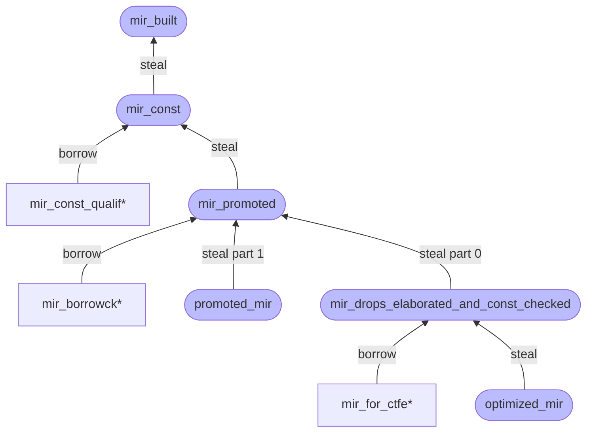

# MIRクエリとパス

MIRを取得したい場合：

- 関数の場合 - `optimized_mir`クエリ（通常はコード生成で使用）または`mir_for_ctfe`クエリ（通常はコンパイル時関数評価、つまり*CTFE*で使用）を使用できます。
- 昇格の場合 - `promoted_mir`クエリを使用できます。

これらは、最終的な最適化されたMIRを返します。外部def-idの場合、単に他のクレートのメタデータからMIRを読み取ります。ただし、ローカルdef-idの場合、クエリは上流クエリ[^query]のパイプラインを要求して最適化されたMIRを構築します。各クエリには、一連のパスが含まれます。このセクションでは、これらのクエリとパスがどのように機能し、どのように拡張できるかについて説明します。

指定されたdef-id `D`に対する最適化されたMIRを生成するために、`optimized_mir(D)`はいくつかのパススイートを経ます。各スイートはクエリによってグループ化されます。各スイートは、リント、解析、変換、または最適化を実行するパスで構成されます。各クエリは、型チェックやその他の目的でMIR方言にアクセスできる有用な中間点を表します：

- `mir_built(D)` – 構築直後の初期MIRを提供します。
- `mir_const(D)` – MIRを定数修飾のために準備するために、いくつかの単純な変換パスを適用します。
- `mir_promoted(D)` - 昇格可能な一時変数を個別のMIR本体に抽出し、MIRを借用チェックのために準備します。
- `mir_drops_elaborated_and_const_checked(D)` - 借用チェックを実行し、主要な変換パス（ドロップ精緻化など）を実行し、MIRを最適化のために準備します。
- `optimized_mir(D)` – すべての有効な最適化を実行し、最終状態に到達します。

[^query]: クエリの一般的な概念については、[クエリ](../query.md)の章を参照してください。

## パスの実装と登録

`MirPass`は、MIRを処理するコードの一部で、通常は何らかの方法で変換します。ただし、リント（例：[`CheckPackedRef`][lint1]、[`CheckConstItemMutation`][lint2]、[`FunctionItemReferences`][lint3]、これらは`MirLint`を実装します）や最適化（例：[`SimplifyCfg`][opt1]、[`RemoveUnneededDrops`][opt2]）のような他のことも行う可能性があります。ほとんどのMIRパスは[`rustc_mir_transform`][mirtransform]クレートで定義されていますが、`MirPass`トレイト自体は`rustc_middle`クレートで[見つかり][mirpass]、基本的には1つの主要なメソッド`run_pass`で構成されており、単に`&mut Body`（`tcx`とともに）を取得します。したがって、MIRはその場で変更されます（これにより、効率を保つのに役立ちます）。

MIRパスの基本的な例は[`RemoveStorageMarkers`]です。これはMIRを歩き、コード生成中に発行されない場合はすべてのストレージマークを削除します。そのソースからわかるように、MIRパスは、最初にフィールドのないダミー型、構造体を定義することによって定義されます：

```rust
pub struct RemoveStorageMarkers;
```

その後、`MirPass`トレイトを実装できます。次に、このパスを、`mir_built`、`optimized_mir`などのクエリで見つかるパスの適切なリストに挿入できます。（これが最適化の場合は、`optimized_mir`リストに入れる必要があります。）

MIRパスの別の例は[`CleanupPostBorrowck`][cleanup-pass]で、MIRを歩いてコード生成に関連しないすべてのステートメントを削除します。その[ソース][cleanup-source]からわかるように、最初にフィールドのないダミー型、構造体を定義することによって定義されます：

```rust
pub struct CleanupPostBorrowck;
```

その後、`MirPass`トレイトを実装します：

```rust
impl<'tcx> MirPass<'tcx> for CleanupPostBorrowck {
    fn run_pass(&self, tcx: TyCtxt<'tcx>, body: &mut Body<'tcx>) {
        ...
    }
}
```

このパスを`mir_drops_elaborated_and_const_checked`クエリ内に[登録][pass-register]します。（これが最適化の場合は、`optimized_mir`リストに入れる必要があります。）

パスを書いている場合、[MIRビジター]を使用したいと思う可能性が高いです。MIRビジターは、MIRのすべての部分を歩くための便利な方法で、何かを検索したり、小さな編集を行ったりするのに便利です。

## 盗み

中間クエリ`mir_const()`と`mir_promoted()`は、`tcx.alloc_steal_mir()`を使用して割り当てられた`&'tcx Steal<Body<'tcx>>`を返します。これは、結果が後続のクエリによって**盗まれる**可能性があることを示します。これは、MIRのクローニングを避けるための最適化です。盗まれた結果を使用しようとすると、コンパイラでパニックが発生します。したがって、MIR処理パイプラインの依存関係を考慮せずに、これらの中間クエリから誤って読み取らないことが重要です。

この盗みメカニズムのために、特定のフェーズでのMIRが盗まれる前に、そこから読み取りたい可能性のあるすべての人がすでにそうしていることを確認するために、ある程度の注意を払う必要があります。

具体的には、クエリ`foo(D)`が`mir_promoted(D)`の結果にアクセスしたい場合は、`foo(D)`が最初に`mir_const(D)`クエリを呼び出す必要があります。これにより、その結果を直接必要としなくても、それが強制的に実行されます。

> このメカニズムは少し怪しいです。[rust-lang/rust#41710]には、よりエレガントな代替案の議論があります。

### 概要

以下は、MIR処理パイプライン[^part]における盗み依存関係の概要です：



深い色のスタジアム形状のクエリ（例：`mir_built`）はパイプラインの主要なクエリですが、浅い色の長方形形状のクエリ（例：`mir_const_qualif*`[^star]）は、`&'tcx Steal<Body<'tcx>>`から結果を読み取る必要がある後続のクエリです。盗みメカニズムにより、長方形形状のクエリは、依存関係ツリーで等しいまたはそれより大きい高さを持つスタジアム形状のクエリが実行される前に実行される必要があります。

[^part]: `mir_promoted`クエリは、タプル`(&'tcx Steal<Body<'tcx>>, &'tcx Steal<IndexVec<Promoted, Body<'tcx>>>)`を返します。`promoted_mir`はパート1（`&'tcx Steal<IndexVec<Promoted, Body<'tcx>>>`）を盗み、`mir_drops_elaborated_and_const_checked`はパート0（`&'tcx Steal<Body<'tcx>>`）を盗みます。そして、それらの盗みは互いに無関係です。つまり、個別に実行できます。

[^star]: クエリの`*`サフィックスは、同じプレフィックスを持つクエリのセットを表すことに注意してください。例えば、`mir_borrowck*`は`mir_borrowck`、`mir_borrowck_const_arg`、および`mir_borrowck_opt_const_arg`を表します。

### 例

例として、MIR定数修飾を考えてみましょう。これは、`mir_const`クエリによって生成された結果を読み取りたいと考えています。ただし、その結果は、パイプラインのある時点で`mir_promoted`クエリによって**盗まれます**。`mir_promoted`がクエリされる前に、`mir_const_qualif`クエリを呼び出すと成功します。なぜなら、`mir_const`は（初めてクエリされた場合）`Steal`結果を生成するか、（複数回クエリされた場合）キャッシュし、結果はまだ**盗まれていない**からです。`mir_promoted`がクエリされた後、結果は盗まれ、`mir_const_qualif`クエリを呼び出して結果を読み取ろうとするとパニックが発生します。

したがって、この盗みメカニズムにより、`mir_promoted`は、実際に盗む前にすべての`mir_const_qualif*`クエリが呼び出されることを保証する必要があります。これにより、読み取りがすでに発生していることが保証されます（[クエリはメモ化される](../query.html)ことを覚えておいてください。したがって、クエリを2回実行すると、2回目は単にキャッシュから読み込まれます）。

[rust-lang/rust#41710]: https://github.com/rust-lang/rust/issues/41710
[mirpass]: https://doc.rust-lang.org/nightly/nightly-rustc/rustc_mir_transform/pass_manager/trait.MirPass.html
[lint1]: https://doc.rust-lang.org/nightly/nightly-rustc/rustc_mir_transform/check_packed_ref/struct.CheckPackedRef.html
[lint2]: https://doc.rust-lang.org/nightly/nightly-rustc/rustc_mir_transform/check_const_item_mutation/struct.CheckConstItemMutation.html
[lint3]: https://doc.rust-lang.org/nightly/nightly-rustc/rustc_mir_transform/function_item_references/struct.FunctionItemReferences.html
[opt1]: https://doc.rust-lang.org/nightly/nightly-rustc/rustc_mir_transform/simplify/enum.SimplifyCfg.html
[opt2]: https://doc.rust-lang.org/nightly/nightly-rustc/rustc_mir_transform/remove_unneeded_drops/struct.RemoveUnneededDrops.html
[mirtransform]: https://doc.rust-lang.org/nightly/nightly-rustc/rustc_mir_transform/
[`RemoveStorageMarkers`]: https://doc.rust-lang.org/nightly/nightly-rustc/rustc_mir_transform/remove_storage_markers/struct.RemoveStorageMarkers.html
[cleanup-pass]: https://doc.rust-lang.org/nightly/nightly-rustc/rustc_mir_transform/cleanup_post_borrowck/struct.CleanupPostBorrowck.html
[cleanup-source]: https://github.com/rust-lang/rust/blob/e2b52ff73edc8b0b7c74bc28760d618187731fe8/compiler/rustc_mir_transform/src/cleanup_post_borrowck.rs#L27
[pass-register]: https://github.com/rust-lang/rust/blob/e2b52ff73edc8b0b7c74bc28760d618187731fe8/compiler/rustc_mir_transform/src/lib.rs#L413
[MIRビジター]: ./visitor.html
