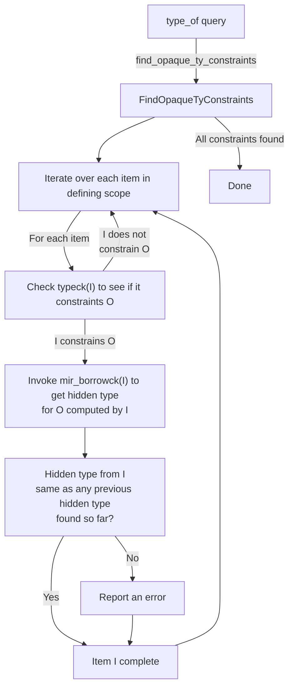
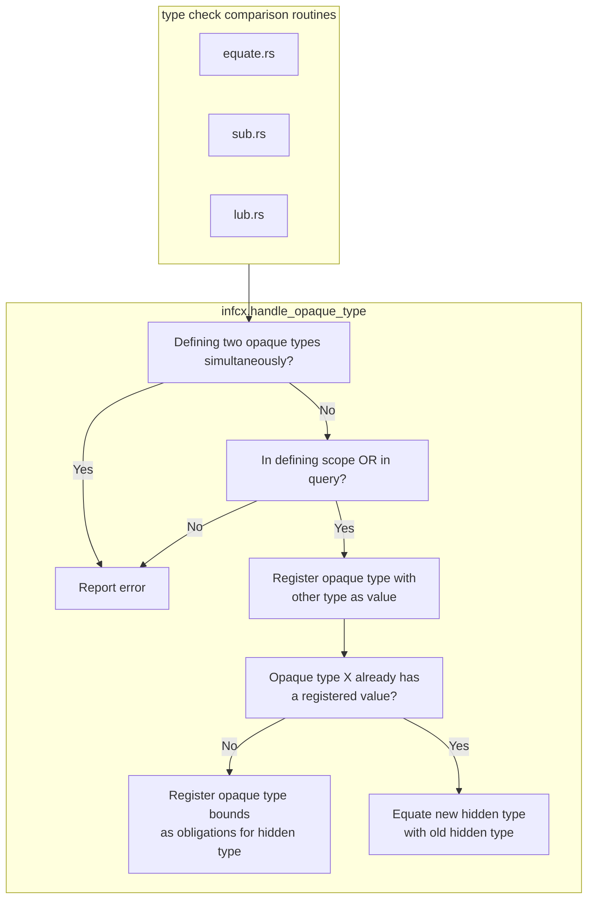

# 不透明型の推論（`impl Trait`）

このページでは、コンパイラが不透明型の[隠蔽型]をどのように推論するかを説明します。
この種の型推論は、他の種類の型推論とは異なり、
関数や関数本体をまたいで機能するため、特に複雑です。

[隠蔽型]: ./borrow_check/region_inference/member_constraints.html?highlight=%22hidden%20type%22#member-constraints
[opaque type]: ./opaque-types-type-alias-impl-trait.md

## 実行例

動作を説明するために、例を考えてみましょう。

```rust
#![feature(type_alias_impl_trait)]
mod m {
    pub type Seq<T> = impl IntoIterator<Item = T>;

    #[define_opaque(Seq)]
    pub fn produce_singleton<T>(t: T) -> Seq<T> {
        vec![t]
    }

    #[define_opaque(Seq)]
    pub fn produce_doubleton<T>(t: T, u: T) -> Seq<T> {
        vec![t, u]
    }
}

fn is_send<T: Send>(_: &T) {}

pub fn main() {
    let elems = m::produce_singleton(22);

    is_send(&elems);

    for elem in elems {
        println!("elem = {:?}", elem);
    }
}
```

このコードでは、*不透明型*は`Seq<T>`です。
その定義スコープはモジュール`m`です。
その*隠蔽型*は`Vec<T>`で、
これは`m::produce_singleton`と`m::produce_doubleton`から推論されます。

`main`関数では、不透明型はその定義スコープの外にあります。
`main`が`m::produce_singleton`を呼び出すと、不透明型`Seq<i32>`への参照を受け取ります。
`is_send`呼び出しは`Seq<i32>: Send`をチェックします。
`Send`はimpl traitの境界に列挙されていませんが、
自動トレイト漏洩のおかげで、それが成り立つことを推論できます。
`for`ループの脱糖には`Seq<T>: IntoIterator`が必要で、
これは`Seq<T>`に宣言された境界から証明可能です。

### `main`の型チェック

まず、`main`を型チェックするときに何が起こるかを見てみましょう。
最初に`produce_singleton`を呼び出すと、戻り値の型は不透明型
[`OpaqueTy`](https://doc.rust-lang.org/nightly/nightly-rustc/rustc_hir/hir/enum.ItemKind.html#variant.OpaqueTy)です。

#### forループの型チェック

forループは`in elems`の部分を`IntoIterator::into_iter(elems)`に脱糖します。
`elems`の型は`Seq<T>`なので、型チェッカーは`Seq<T>: IntoIterator`という責務を登録します。
この責務は簡単に満たされます。
なぜなら、`Seq<T>`は不透明型（`impl IntoIterator<Item = T>`）であり、そのトレイトの境界を持っているからです。
`U: Foo`というwhere境界が`U`を簡単に`Foo`を満たすようにするのと同様に、
不透明型の境界は型チェッカーに利用可能であり、責務を満たすために使用されます。

forループ内の`elem`の型は`<Seq<T> as IntoIterator>::Item`と推論され、これは`T`です。
型チェッカーが隠蔽型に興味を持つことは一度もありません。

#### `is_send`呼び出しの型チェック

自動トレイト境界を証明しようとするとき、
まず上記と同じプロセスを繰り返して、
自動トレイトが不透明型の境界リストにあるかどうかを確認します。
それが失敗した場合、不透明型の隠蔽型を明らかにしますが、
この特定のトレイト境界を証明するためだけであり、一般的にではありません。
明らかにするには、不透明型の`DefId`に対して`type_of`クエリを呼び出します。
クエリは、定義関数から隠蔽型を内部的に要求し、
それを返します（詳細については[`type_of`に関するセクション](#within-the-type_of-query)を参照してください）。

#### 型チェックステップのフローチャート

```mermaid
flowchart TD
    TypeChecking["type checking `main`"]
    subgraph TypeOfSeq["type_of(Seq<T>) query"]
        WalkModuleHir["Walk the HIR for the module `m`\nto find the hidden types from each\nfunction/const/static within"]
        VisitProduceSingleton["visit `produce_singleton`"]
        InterimType["`produce_singleton` hidden type is `Vec<T>`\nkeep searching"]
        VisitProduceDoubleton["visit `produce_doubleton`"]
        CompareType["`produce_doubleton` hidden type is also Vec<T>\nthis matches what we saw before ✅"]
        Done["No more items to look at in scope\nReturn `Vec<T>`"]
    end

    BorrowCheckProduceSingleton["`borrow_check(produce_singleton)`"]
    TypeCheckProduceSingleton["`type_check(produce_singleton)`"]

    BorrowCheckProduceDoubleton["`borrow_check(produce_doubleton)`"]
    TypeCheckProduceDoubleton["`type_check(produce_doubleton)`"]

    Substitute["Substitute `T => u32`,\nyielding `Vec<i32>` as the hidden type"]
    CheckSend["Check that `Vec<i32>: Send` ✅"]

    TypeChecking -- trait code for auto traits --> TypeOfSeq
    TypeOfSeq --> WalkModuleHir
    WalkModuleHir --> VisitProduceSingleton
    VisitProduceSingleton --> BorrowCheckProduceSingleton
    BorrowCheckProduceSingleton --> TypeCheckProduceSingleton
    TypeCheckProduceSingleton --> InterimType
    InterimType --> VisitProduceDoubleton
    VisitProduceDoubleton --> BorrowCheckProduceDoubleton
    BorrowCheckProduceDoubleton --> TypeCheckProduceDoubleton
    TypeCheckProduceDoubleton --> CompareType --> Done
    Done --> Substitute --> CheckSend
```

### `type_of`クエリ内

`type_of`クエリは、不透明型Oに適用されると、隠蔽型を返します。
その隠蔽型は、Oの定義スコープ内の各制約関数から
結果を結合して計算されます。



### 不透明型を別の型に関連付ける

不透明型が隠蔽型に制約される中心的な場所が1つあり、
それは`handle_opaque_type`関数です。
面白いことに、この関数は2つの型を受け取るため、任意の2つの型を渡すことができますが、
そのうちの1つは不透明型である必要があります。
順序は診断にのみ重要です。



### クエリとの相互作用

クエリが不透明型を処理するとき、
定義スコープにいるかどうかを判断できないため、
いるものと仮定するだけです。

登録された隠蔽型は`QueryResponse`構造体の
`opaque_types`フィールドに格納されます（関数
`take_opaque_types_for_query_response`がそれらを読み出します）。

`query_response_substitution_guess`で`QueryResponse`が
周囲のinfcxにインスタンス化されるとき、
各隠蔽型制約を（上記のように）`handle_opaque_type`を呼び出して変換します。

1つの「奇妙さ」があります。
インスタンス化された不透明型には順序があります
（ある不透明型が別の不透明型と比較され、
隠蔽型が割り当てられる不透明型として使用する不透明型を1つ選択する必要がある場合）。
「期待される」と見なされる不透明型を使用します。
しかし実際には、両方の不透明型が定義の使用を持っている可能性があります。
クエリ結果がインスタンス化されるとき、
それはクエリを使用しているコンテキストから再評価されます。
最終的なコンテキスト（関数のtypeck、mir borrowckまたはwf-checks）は、
どの不透明型が実際にインスタンス化できるかを知り、
正しく処理します。

### MIR借用チェッカー内

MIR借用チェッカーは`nll_relate`を介して物事を関連付け、領域のみを気にします。
任意の型関係は隠蔽型のバインディングをトリガーするため、
借用チェッカーは型チェッカーと同じことを行いますが、
明らかにデッドコード（例：パニック後）を無視します。
借用チェッカーは、隠蔽型に関しては真実の源でもあります。
なぜなら、隠蔽型のどのライフタイムが
不透明型宣言のどのライフタイムに対応するかを適切に理解できる唯一のものだからです。

## 後方互換性ハック

戻り位置の`impl Trait`には、RFCの一部ではなく、
おそらく偶発的な安定化である様々な癖があります。
これらをサポートするために、
`replace_opaque_types_with_inference_vars`を使用して、以前の動作を再導入します。

3つの後方互換性ハックがあります：

1. すべての戻りサイトが同じ推論変数を共有するため、
   一部の戻りサイトは、別の戻りサイトが具体的な型を使用する場合にのみコンパイルされる可能性があります。
    ```rust
    fn foo() -> impl Debug {
        if false {
            return std::iter::empty().collect();
        }
        vec![42]
    }
    ```
2. `impl Trait`の関連型等価性制約は、
   隠蔽型が関連型のトレイト境界を満たす限り使用できます。
   不透明な`impl Trait`シグネチャはそれらを満たす必要はありません。

    ```rust
    trait Duh {}

    impl Duh for i32 {}

    trait Trait {
        type Assoc: Duh;
    }

    // the fact that `R` is the `::Output` projection on `F` causes
    // an intermediate inference var to be generated which is then later
    // compared against the actually found `Assoc` type.
    impl<R: Duh, F: FnMut() -> R> Trait for F {
        type Assoc = R;
    }

    // The `impl Send` here is then later compared against the inference var
    // created, causing the inference var to be set to `impl Send` instead of
    // the hidden type. We already have obligations registered on the inference
    // var to make it uphold the `: Duh` bound on `Trait::Assoc`. The opaque
    // type does not implement `Duh`, even if its hidden type does.
    // Lazy TAIT would error out, but we inserted a hack to make it work again,
    // keeping backwards compatibility.
    fn foo() -> impl Trait<Assoc = impl Send> {
        || 42
    }
    ```
3. クロージャは親関数の`impl Trait`の隠蔽型を作成できません。
   この点はほとんど問題になりません。
   なぜなら、ポイント1が推論変数を導入するため、
   クロージャは推論変数しか見ないからですが、1を修正すればこれが問題になります。
