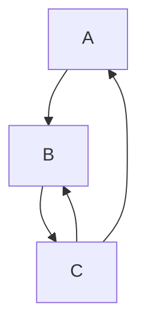

# 新しいトレイトソルバーにおけるキャッシング

トレイトソルバーの結果をキャッシュすることは、パフォーマンスのために必要です。
キャッシュが健全であることを確認する必要があります。キャッシングは
[`SearchGraph`]によって処理されます。

[`SearchGraph`]: https://github.com/rust-lang/rust/blob/7606c13961ddc1174b70638e934df0439b7dc515/compiler/rustc_trait_selection/src/solve/search_graph.rs#L102-L117

## グローバルキャッシュ

その中核において、キャッシュは非常にシンプルです。ゴールを評価する際に、
それがグローバルキャッシュに存在するかをチェックします。存在する場合は、そのエントリを再利用します。存在しない場合は、
ゴールを計算し、その結果をキャッシュに保存します。

インクリメンタルコンパイルに対処するため、ゴールの計算は
[`DepGraph::with_anon_task`][`with_anon_task`]内で行われ、この計算内で使用されるすべてのクエリに依存する新しい`DepNode`が作成されます。グローバルキャッシュにアクセスする際には、この
`DepNode`を読み取り、手動で使用されたすべてのクエリへの依存エッジを追加します: [ソース][wdn]。

### オーバーフローへの対処

再帰制限に達することは、新しいトレイトソルバーでは致命的ではなく、単に
曖昧性を返すだけです: [ソース][overflow]。したがって、再帰制限に達するかどうかは、
コンパイル失敗を引き起こすことなく結果を変更できます。これは、
キャッシュ結果にアクセスする際に、残りの利用可能な深さを考慮する必要があることを意味します。

これを行うために、キャッシュエントリにより多くの情報を保存します。評価が
再帰制限に達しなかったゴールについては、単にその到達深さを保存します: [ソース][req-depth]。
これらの結果は、現在の`available_depth`がその`reached_depth`よりも高い限り自由に使用できます: [ソース][req-depth-ck]。その後、グローバルキャッシュエントリを使用したかどうかが観察できないように、現在のゴールの到達深さを更新します: [ソース][update-depth]。

再帰制限に達するゴールについては、現在、利用可能な深さがエントリの深さと*完全に一致する*場合にのみキャッシュされた結果を使用します。したがって、各ゴールのキャッシュエントリには、残りの深さごとに個別の結果が含まれます: [ソース][rem-depth]。[^1]

## サイクルの処理

トレイトソルバーはサイクルをサポートする必要があります。これらのサイクルは、参加するゴールに応じて、帰納的または余帰納的です。詳細については、[余帰納に関する章]を参照してください。
サイクルヘッドとサイクルルートを区別します：スタックエントリは、再帰的にアクセスされる場合、サイクルヘッドです。*ルート*は、任意のサイクルに関与するスタック上の最も深いゴールです。次の依存関係ツリーを考えると、`A`と`B`は両方ともサイクルヘッドですが、`A`だけがルートです。

サイクル参加者の結果は、スタック上にまだあるゴールの結果に依存します。
しかし、現在その結果を計算中であるため、その結果はまだ不明です。これは、
不動点に達するまでサイクルヘッドを評価することで処理されます。最初のイテレーションでは、
サイクルが余帰納的かどうかに応じて、制約のない成功またはオーバーフローのいずれかを返します: [ソース][initial-prov-result]。サイクルのヘッドを評価した後、
その[`provisional_result`]がこのイテレーションの結果と等しいかをチェックします。等しい場合は、
このサイクルの評価を終了し、その結果を返します。等しくない場合は、暫定的な
結果を更新し、ゴールを再評価します: [ソース][fixpoint]。最初のイテレーションの後は、
サイクルが余帰納的か帰納的かは関係ありません。常に暫定的な結果を使用します。

### サイクルルートのみをキャッシュ

サイクルルートの評価を完了するまで、サイクル参加者の結果をグローバルキャッシュに移動することはできません。しかし、サイクルを完全に評価した後でも、
ルート自体以外のすべての参加者の結果を破棄することを余儀なくされます。

すべてのグローバルキャッシュエントリのクエリ依存関係を追跡します。これにより、サイクル参加者のキャッシングが
自明ではなくなります。サイクルルートの`DepNode`を単純に再利用することはできません。[^2]サイクル`A -> B -> A`がある場合、`A`の`DepNode`には`A -> B`からの依存関係が含まれます。このエントリを`B`に再利用すると、ソースが変更された場合に壊れる可能性があります。`B -> A`
エッジが存在しなくなり、`A`が完全に削除された可能性があります。これは簡単にICEを引き起こす可能性があります。

しかし、さらに悪いことに、サイクルの結果は、どのゴールが
ルートであるかによって変わる可能性があります: [例][unstable-result-ex]。これにより、キャッシングをさらに弱める必要があります。
そのサイクルに関与するルートの参加者であったスタックエントリが存在する場合、サイクルルートのキャッシュエントリを使用してはなりません。これを行うには、特定のルートのすべてのサイクル参加者を
そのグローバルキャッシュエントリに保存し、スタックの要素が含まれていないことをチェックします: [ソース][cycle-participants]。

### 暫定的キャッシュ

TODO: これを書く :3

- 暫定的な結果のスタック依存性
- エッジケース: 暫定的キャッシュが動作に影響を与える

[`with_anon_task`]: https://github.com/rust-lang/rust/blob/7606c13961ddc1174b70638e934df0439b7dc515/compiler/rustc_trait_selection/src/solve/search_graph.rs#L391
[wdn]: https://github.com/rust-lang/rust/blob/7606c13961ddc1174b70638e934df0439b7dc515/compiler/rustc_middle/src/traits/solve/cache.rs#L78
[overflow]: https://github.com/rust-lang/rust/blob/7606c13961ddc1174b70638e934df0439b7dc515/compiler/rustc_trait_selection/src/solve/search_graph.rs#L276
[req-depth]: https://github.com/rust-lang/rust/blob/7606c13961ddc1174b70638e934df0439b7dc515/compiler/rustc_middle/src/traits/solve/cache.rs#L102
[req-depth-ck]: https://github.com/rust-lang/rust/blob/7606c13961ddc1174b70638e934df0439b7dc515/compiler/rustc_middle/src/traits/solve/cache.rs#L76-L86
[update-depth]: https://github.com/rust-lang/rust/blob/7606c13961ddc1174b70638e934df0439b7dc515/compiler/rustc_trait_selection/src/solve/search_graph.rs#L308
[rem-depth]: https://github.com/rust-lang/rust/blob/7606c13961ddc1174b70638e934df0439b7dc515/compiler/rustc_middle/src/traits/solve/cache.rs#L124
[^1]: これは過度に制限的です：すべてのネストされたゴールが、ある利用可能な深さ`n`でオーバーフロー応答を返す場合、それらの結果は`n`より小さい任意の深さで同じであるべきです。
この最適化は将来実装できます。

[余帰納に関する章]: ./coinduction.md
[`provisional_result`]: https://github.com/rust-lang/rust/blob/7606c13961ddc1174b70638e934df0439b7dc515/compiler/rustc_trait_selection/src/solve/search_graph.rs#L57
[initial-prov-result]: https://github.com/rust-lang/rust/blob/7606c13961ddc1174b70638e934df0439b7dc515/compiler/rustc_trait_selection/src/solve/search_graph.rs#L366-L370
[fixpoint]: https://github.com/rust-lang/rust/blob/7606c13961ddc1174b70638e934df0439b7dc515/compiler/rustc_trait_selection/src/solve/search_graph.rs#L425-L446
[^2]: 関連する[Zulipスレッド]を要約しています

[zulip thread]: https://rust-lang.zulipchat.com/#narrow/stream/364551-t-types.2Ftrait-system-refactor/topic/global.20cache
[unstable-result-ex]: https://github.com/rust-lang/rust/blob/7606c13961ddc1174b70638e934df0439b7dc515/tests/ui/traits/next-solver/cycles/coinduction/incompleteness-unstable-result.rs#L4-L16
[cycle-participants]: https://github.com/rust-lang/rust/blob/7606c13961ddc1174b70638e934df0439b7dc515/compiler/rustc_middle/src/traits/solve/cache.rs#L72-L74
